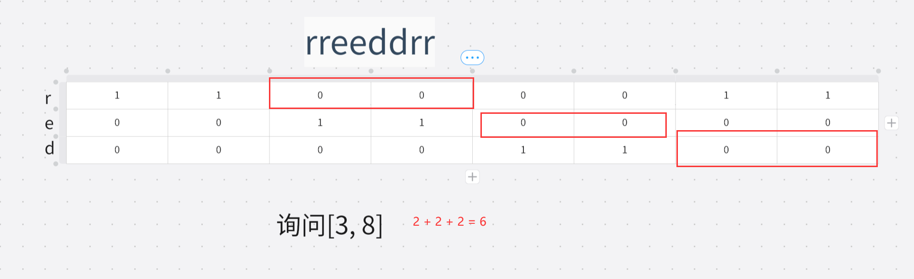

# 牛客小白月赛91

链接：https://ac.nowcoder.com/acm/contest/78807/D

有一个长度为$n$ 的数字字符串$S$，该字符串仅包含$[0,9]$的数字
从中挑选出若干个字符，然后按照其相对顺序重新拼接而成一个数字，使其是一个**无前导**$0$**的偶数**。

 例如：当$n=3,S=100$。 其包含的偶数数字有$0,0,10,10,100$。而$00$是不符合条件的，因为其含有前导0。

 由于字符串实在是太长了，他一个人数不过来，请您帮他计算一下该字符串中含有的偶数方案总数， 结果对$10^9+7$取模。

> dp

> 

```java
import java.io.*;
import java.util.*;
public class Main {
	static Read r = new Read();
	static Scanner s = new Scanner(System.in);
	static BufferedReader bf = new BufferedReader(new InputStreamReader(System.in));
	static int n, maxn = 200000, mod = (int)1e9+7;
	static char[] str;
	public static void main(String[] args) throws IOException {
		n = s.nextInt();
		str = s.next().toCharArray();
//		int[] dp = new int[maxn+1];
		long res = 0, cnt = 0;
		for(int i = 0;i<=n-1;i++) {
			int x = str[i]-'0';
			if(x==0) {
				res = (res + cnt +1)%mod;
				cnt=(cnt*2)%mod;
			}else if(x%2==0) {
				res = (res + cnt +1)%mod;
				cnt=(cnt*2+1)%mod;
			}else {
				cnt=(cnt*2+1)%mod;
			}
		}
		
		
		System.out.print(res);
	}
}


class Read{
	StreamTokenizer st = new StreamTokenizer(new BufferedReader(new InputStreamReader(System.in)));
	public int nextInt() throws IOException {
		st.nextToken();
		return (int)st.nval;
	}
}
```


# 牛客小白月赛92

**B采矿时间到！**

链接：https://ac.nowcoder.com/acm/contest/81126/B

这一天你挖了一条长度为 $n$，宽度为 $1$ 的矿道，你最多只能在这条矿道向左/右正方向拓宽$2$格，并且你只能**垂直**于矿道挖掘。

```
##*#############**##
#########*##########
....................
#####*######**######
#*##################
```

 如上图所示，'.' 表示矿道，'#' 表示的是圆石，'*' 表示的是矿石。
 本题固定第三行为矿道，第一二行 为你的左侧，第四/五行 为你的右侧。
 因为你只能站在矿道上，至多向左/右正方向拓宽 $2$ 格，所以本题只给出 $5n$ 的俯视图。

每拓宽一格，需要花费$1$ 点体力。现在您有 h\mathit hh 点体力，问你**最多**能得到多少矿石？

> 模拟，贪心

> 先玩第2，4行的。若矿石后面（1，5行）还有矿石，则挖掉。
>
> 再取挖1，5行的埋在2，4行#后面的矿石，知道体力耗尽。

```java
import java.util.*;
public class Main {
	static Scanner s = new Scanner(System.in);
	public static void main(String[] args) {
		String[] str = new String[5];
		int[] num = new int[5];
		int l = s.nextInt();
		int h = s.nextInt();
		for(int i = 0 ;i<=4;i++) {
			str[i] = s.next();
		}
		int res = 0;
		for(int i = 0; i<=l -1; i++) {
			if(h <=0) break;
			if(str[1].charAt(i) == '*') {
				h --;
				res ++;
			}
			if(h <=0) break;
			if(str[1].charAt(i) == '*'&&str[0].charAt(i) == '*') {
				h --;
				res ++;
			}
		}
		for(int i = 0; i<=l -1; i++) {
			if(h <=0) break;
			if(str[3].charAt(i) == '*') {
				h --;
				res ++;
			}
			if(h <=0) break;
			if(str[3].charAt(i) == '*'&&str[4].charAt(i) == '*') {
				h --;
				res ++;
			}
		}
		for(int i = 0; i<=l -1; i++) {
			if(h <=1) break;
			if(str[0].charAt(i) == '*'&&str[1].charAt(i)=='#') {
				h-=2;
				res ++;
			}
			if(h <=1) break;
			if(str[4].charAt(i) == '*'&&str[3].charAt(i)=='#') {
				h-=2;
				res ++;
			}
		}
		System.out.print(res);
	}
}
```


**C耕种时间到！**

链接：https://ac.nowcoder.com/acm/contest/81126/C

定义等级为 $\mathit x$ 的小麦，收割后可以得到 $2$ 枚 等级为 $\lceil\dfrac{x}{3}\rceil$ 的小麦种子。现在你有 $n$ 枚小麦种子，第 $i$ 枚种子的等级为 $a_i$，你可以全部种下，也可以选择全部都不种下。小麦成熟以后，你可以进行收割，收割必须收割所有种下的小麦。现在你想知道，在任意时刻(收割前或收割后)最多能拥有多少枚等级为 $x$ 的小麦种子？

> 模拟

> 用两个数组记录等级和数量，每一轮种植更新等级并记录$x$等级的数量，记录最大值。直到所有种子等级小于$x$

```java
import java.util.*;
public class Main {
	static Scanner s = new Scanner(System.in);
	public static void main(String[] args) {
		int n = s.nextInt();
		int[] a = new int[n];
		int maxa = 0;
		for(int i = 0; i<=n-1; i++) {
			a[i] = s.nextInt();
			maxa = Math.max(maxa, a[i]);
		}
		long [] num = new long[n];
		for(int i = 0; i<=n -1; i++) num[i] =1;
		int x = s.nextInt();
		long max = 0;
		while(maxa>1) {
			long res = 0;
			for(int i = 0; i<=n-1; i++) {
				if(a[i] == x) res+=num[i];
			}	
			max = Math.max(max, res);
			for(int i = 0; i<=n-1; i++) {
				a[i] = (int) Math.ceil((a[i]/3.0));
				num[i] *=2;
			}
			maxa = (int) Math.ceil((maxa/3.0));
		}
		System.out.print(max);
	}
}
```

**D探索的时光**

链接：https://ac.nowcoder.com/acm/contest/81126/D

目前你已知 $n$ 个生物群系的位置(从 $1$ 到 $n$编号)，你需要去探索，第$i$ 个生物群系的危险系数为 aia_iai。定义第 iii 个生物群系的危险度为$ f(i)=(x−i)^2∗a_i$，$x$ 为庇护所 所在生物群系的编号。现在你可以选择一个生物群系作为自己的庇护所，你想要知道所有可能情况下危险度之和的**最小值**是多少？

> 即求$\sum_{i=1}^{n}(x-i)^2*a_i$最小值，等于$\sum_{i=1}^{n}a_ix^2-2\sum_{i=1}^{n}ia_ix+\sum_{i=1}^{n}i^2a_i$。遍历$x$的值记录最小值
>
> **注意：$i^2、ia_i$都有可能超过`int`，乘以一个`Long`类型的`1L`转换**

```java
import java.util.*;
public class Main {
    static Scanner s = new Scanner(System.in);
    static int n;
    static long a = 0,b = 0,c = 0;
    public static void main(String[] args) {
        n = s.nextInt();
        for(int i = 1; i<=n;i++) {
            long ai = s.nextLong();
            a += 1l*ai;
            b += 2l*i*ai;
            c += 1l*i*i*ai;
        }
        long res = Long.MAX_VALUE;
        for(int x = 1; x<=n;x++) res = Math.min(res, a*x*x-b*x+c);
        System.out.print(res);
    }
}
```


链接：https://ac.nowcoder.com/acm/contest/81126/E
一枚煤炭可以在熔炉内燃烧 $y$ 秒融化至多 $x$ 单位的铁矿石。

而一枚暗物质可以在熔炉内燃烧$y/2$ 秒融化至多 $2x$ 单位的铁矿石。

同一时刻，熔炉只能燃烧一枚燃料。燃料均不可重复利用。燃料燃烧完之前，你不可以获取熔炉中的矿物。

你有一个神奇的魔法，可以将一枚煤炭升级成暗物质，这个魔法至多只能使用**一次**。

现在你有 $1$ 个熔炉，$n$ 枚煤炭和 $m$ 单位铁矿石，问烧炼 $m$ 单位铁矿石**至少**需要多长时间

>    1.    $dp[i][j][0/1]$：考虑前$i$个煤炭烧$j$个矿石最少需要的时间，$0/1$代表到目前为止是否使用魔法
>
>    2.    初始化：对于$0$颗煤炭烧所有正数数的矿石需要无穷时间，$0$颗矿石则需要$0$的时间；
>
>          $dp[0][j][0/1] = INF(j>=1)、dp[i][0][0/1] = 0$
>
>    3.    对于当前元素，考虑选/不选。 若选且未使用魔法则在加使用魔法的情况。
>
>          $dp[i][j][0] = min(dp[i-1][j][0], dp[i][max(0,j-x[i])][0]+y[i])$
>
>          ​	对于上式右侧两项：第一项为不选，第二项为选
>
>          $dp[i][j][1] = min(dp[i-1][j][1],dp[i-1][max(0,j-x[i])][1]+y[i]),dp[i-1][max(0,j-2x[i])][0]+y[i]/2)])$
>
>          ​	对于上式右侧三项：第一项表示不选，第二项表示选且没用魔法，第三项表示选且用魔法
>
>    4.    结果取$dp[n][m][1]、dp[n][m][0]$较小值

```java
import java.util.*;
public class Main {
    static Scanner s = new Scanner(System.in);
    static long INF = (long)2e18;
    static int n, m, x[], y[];
    static long dp[][][];
    public static void main(String[] args) {
        n = s.nextInt();
        m = s.nextInt();
        x = new int[n+1];
        y = new int[n+1];
        for(int i = 1; i<=n; i++) {
            x[i] = s.nextInt();
            y[i] = s.nextInt();
        }
        dp = new long[n+1][m+1][2];
        for(int j = 1;j<=m;j++) {
            dp[0][j][0] = INF;
            dp[0][j][1] = INF;
        }        
        for(int i = 1; i<=n;i++) {
            for(int j = 0; j<=m;j++) {
                dp[i][j][0] = Math.min(dp[i-1][Math.max(0, j-x[i])][0]+y[i], dp[i-1][j][0]);
                dp[i][j][1] = Math.min(dp[i-1][Math.max(0, j-2*x[i])][0]+y[i]/2, dp[i-1][Math.max(0, j-x[i])][1]+y[i]);
                dp[i][j][1] = Math.min(dp[i][j][1], dp[i-1][j][1]);
            }
        }
        System.out.print(Math.min(dp[n][m][1], dp[n][m][0]));
    }
}
```


# 牛客周赛 Round 41

**B.小红的排列构造**

https://ac.nowcoder.com/acm/contest/80742/B

定义两个数组$a$和$b$的汉明距离为：有多少个下标$i$满足$a_i≠b_i$。例如，$[2,3,1]$和$[1,3,1]$的汉明距离是$1$。
 现在小红拿到了一个长度为$n$的排列$p$，她希望你构造一个长度为$n$的排列$q$，满足$p$和$q$的汉明距离恰好等于$k$。

 排列指长度为$n$的数组，其中$1$到$n$每个元素恰好出现了一次

> 若$k > n $ 或者$k=1$，显然无解。
>
> 因为每个元素都只出现一次，交换两个无汉明距离的元素必定产生增加汉明距离， 交换一个有汉明距离的元素和一个无汉明距离的元素必定增加一个汉明距离。
>
> 遍历序列，设第$i$个数为$a_i$，不断让$a_i$和$a_{i+1}$交换，交换$k-1$次即可。
>
> ——第一次交换产生 2 个距离，后面每一次产生 1 个距离。

```java
import java.util.*;
public class Main {
    static Scanner s = new Scanner(System.in);
    static int n, k, a[];
    public static void main(String[] args){
    	n = s.nextInt();
    	k = s.nextInt();
    	a = new int[n];
    	if(k > n || k == 1) {
    		System.out.print(-1);
    		return;
    	}
    	for(int i = 0; i<n; i++) a[i] = s.nextInt();
    	for(int i = 0; i<=k - 2; i++) {
    		int t = a[i];
    		a[i] = a[i + 1];
    		a[i + 1] = t;
    	}
    	for(int i = 0; i<n; i++) System.out.print(a[i] + " ");
    }
}
```

**C. 小红的循环移位**

https://ac.nowcoder.com/acm/contest/80742/C

小红拿到了一个数字串，她每次操作可以使得其向左循环移动一位。
 将串 $s=s_0s_1...s_{n−1}$​ 向左循环移动一位，将得到串$s_1...s_{n−1}s_0$
 小红想知道，使得该数字串变成4的倍数，需要最少操作多少次？（可以包含前导零）

> 枚举一下 4 的倍数：4  8  **12  16  20  24  28  32  36  40 44 ......**
>
> 发现规律：若数字位数大于1位，若个位数字为 2/6且高一位为奇数，则为4的倍数；若个位数字为4/8/0且高一位为偶数，则为4的倍数。
>
> 有了该规律就可以遍历一遍的情况下找出最小操作次数。
>
> 1. 特判一下一位数
> 2. 先判断 0 次操作是否可行。
> 3. 再判断$1 \sim n-1$次操作，设$a_i$为从左往右第$i$位数字，若$a_i$与$a_{i - 1}$满足规律，则需要操作$i$次
> 4. 若都不行则输出$ - 1$
>
> 时间复杂度：$O(n)$

```java
import java.util.*;
public class Main {
    static Scanner s = new Scanner(System.in);
    public static void main(String[] args){
    	String num = s.next();
    	int n = num.length();   	
    	//特判 一位数
    	if(n == 1) {
    		int x = num.charAt(0) - '0';
    		if(x == 4 || x == 8) {
    			System.out.print(0);return;
    		}else {
    			System.out.print(-1);return;
    		}
    	}
    	// 0 次操作
    	int a = num.charAt(n - 2) - '0';
		int b = num.charAt(n - 1) - '0';
		if(isVlid(a, b)) {System.out.print(0);return;}
		// 1 ~ n - 1次操作
    	for(int i = 0; i<=n - 2; ++ i) {
     		a = num.charAt(i - 1 < 0 ? n - 1 : 0) - '0';//
    		b = num.charAt(i) - '0';
    		if(isVlid(a, b)) {
    			System.out.print(i + 1);return;
    		}
    	}
    	System.out.print(-1);
    }
    public static boolean isVlid(int a, int b) {
    	if(a % 2 == 0) {
			if(b == 4 || b == 8 || b == 0) {
				return true;
			}
		}else {
			if(b == 2 || b == 6) {
				return true;
			}
		}
    	return false;
    }
}
```

D. 小红的好串

https://ac.nowcoder.com/acm/contest/80742/D

小红定义一个字符串是“好串”，当且仅当该该字符串在长度和它相等的字符串中，"red"子序列的数量是最多的。
 例如，"rreedd"是好串，因为包含了8个"red"子序列。而"redred"则不是好串。

 现在小红拿到了一个字符串，她有多次询问，每次询问一个区间，你需要回答将该区间对应的子串修改为好串的最小修改次数（每次修改可以修改任意一个字符）

> 用三个前缀和记录记录每个字母的出现情况，在比较时用前缀和计算。
>
> 对于好串的形式，应当让三个字母数量尽可能接近。当长度不是三的倍数时应当讨论三种情况。



```java
import java.io.*;
import java.util.*;

public class Main {
    static Scanner sc = new Scanner(System.in);
    static PrintWriter pw = new PrintWriter(new BufferedWriter(new OutputStreamWriter(System.out)));
    static int n, m, l , r, s[][];
    static char[] c;  
    public static void main(String[] args) throws Exception {
        n = sc.nextInt();
        m = sc.nextInt();
        c = sc.next().toCharArray();
        s = new int[n + 1][3];
        for(int i = 1; i <= n; i ++){
            s[i][getc(c[i - 1])] ++;
            for(int j = 0; j < 3; j ++) s[i][j] += s[i - 1][j];
        }
        while(m --> 0){
            l = sc.nextInt();
            r = sc.nextInt();
            int d = r - l + 1;
            if(d <= 2) {
                pw.println(0);
                continue;
            }
            int ans = (int) 1e9;
            int len = d / 3;
            if(d % 3 == 0){
                int k1 = l + len - 1, k2 = l + 2 * len - 1;
                ans = d - get(k1, k2); 
            }else if(d % 3 == 1){
                int k1 = l + len - 1, k2 = l + 2 * len - 1;
                ans = d - get(k1, k2);
                k2 ++;
                ans = Math.min(ans, d - get(k1, k2));
                k1 ++;
                ans = Math.min(ans, d - get(k1, k2));
            }else{
                int k1 = l + len, k2 = k1 + len + 1;
                ans = d - get(k1, k2);
                k2 --;
                ans = Math.min(ans, d - get(k1, k2));
                k1 --;
                ans = Math.min(ans, d - get(k1, k2));
            }
            pw.println(ans);
        }
        pw.flush();pw.close(); 
    }
    public static int get(int k1, int k2){
        return s[k1][0] - s[l - 1][0] + s[k2][1] - s[k1][1] + s[r][2] - s[k2][2];
    }
    public static int getc(char c){
        if(c == 'r') return 0;
        if(c == 'e') return 1;
        return 2;
    }
}

```

# 牛客小白月赛93

 **B. 交换数字**

链接：https://ac.nowcoder.com/acm/contest/82401/B

有两个长度均为 $n$且不包含前导零的数字 a,ba,ba,b ，现在他可以对这两个数字进行任意次操作： 

1. ​		选择一个整数 $1≤i≤n$ ,并交换 $a,b$ 的第 $i$ 位 。 

   请输出任意次操作后$a \times b$ 的最小值，由于答案可能很大，请对 $998244353$ 取模。

> 贪心

> 将一个数换为最大，另一个换为最小即可。
>
> 初始化最大最小数为$A=0、B=0$， 从前往后遍历，设第$i$个位置的数的较大较小值分别为为$a_i$和$b_i$，将较大值添加到$A$的后面$(A\times10 + a_i)$，较小值添加到$B$的后面$(B\times 10 +b_i)$，同时计算结果$(A\times10 + a_i)\times (B\times 10 +b_i)$，计算过程中不断mod。
>
> 这样不需要写交换的逻辑。
>
> $O(n)$

```java
import java.io.*;
import java.util.*;
public class Main {
    static Scanner sc = new Scanner(System.in);
    static PrintWriter pw = new PrintWriter(new BufferedWriter(new OutputStreamWriter(System.out)));
    static int n;
    static char[] s1, s2;
    static int mod = 998244353;
    public static void main(String[] args) throws IOException {
    	n = sc.nextInt();
    	s1 = sc.next().toCharArray();
    	s2 = sc.next().toCharArray();
    	long ans = 0, A = 0, B = 0;
    	for(int i = 0; i<n; i++) {
    		int a = Math.max(s1[i] - '0', s2[i] - '0');
    		int b  = Math.min(s1[i] - '0', s2[i] - '0');
    		ans = ( ((A * 10 + a)%mod) * ((B * 10 + b)%mod) ) % mod;
    		A = (A * 10 + a)%mod;
    		B = (B * 10 + b)%mod;
    	}
    	pw.print(ans);
    	pw.flush();
	}
}
```

**C. 老虎机**

链接：https://ac.nowcoder.com/acm/contest/82401/C

老虎机游玩规则：共有三个窗口，每个窗口在每轮游玩过程中会等概率从图案库里选择一个图案，根据最后三个窗口中图案的情况获得相应的奖励。

 现在你设定了图案的数量为 $m$，没有相同的图案得 $a$ 元，一对相同的图案 $b$ 元，三个相同的图案 $c$ 元。

​	你想知道在你设定的规则下，单次游玩期望收益是多少？答案对 $998244353$ 取模。

​	根据 **逆元** 的定义，如果你最后得到的答案是形如 $\frac{a}{b}$ 的分数，之后你需要对 $p$ 取模的话，你需要输出 $(a×b^{mod−2}) mod \ p$ 来保证你的答案是正确的。

> 数学期望、快速幂

> 三种情况的期望：
>
> 1. 为$0$：$m \times (\frac{1}{m} \times \frac{m-1}{m}\times\frac{m - 2}{m}) \times a$
> 2. 为$2$：$m\times(3\times\frac{1}{m}\times\frac{1}{m}\times\frac{m-1}{m})\times b$
> 3. 为$3$：$m \times(\frac{1}{m}\times\frac{1}{m}\times\frac{1}{m})\times c$

```java
import java.io.*;
import java.util.*;
public class Main {
    static Scanner sc = new Scanner(System.in);
    static PrintWriter pw = new PrintWriter(new BufferedWriter(new OutputStreamWriter(System.out)));
    static long T, m, a, b, c;
    static int mod = 998244353;
    public static void main(String[] args) throws IOException {
    	T = sc.nextInt();
    	while(T --> 0) {
    		m = sc.nextLong();
    		a = sc.nextLong();
    		b = sc.nextLong();
    		c = sc.nextLong();
    		long u = ( (m - 1)*(m - 2)*a + 3*(m - 1)*b + c ) % mod; //防止超后面超Long
    		long d = m * m % mod;//防止超后面超Long
    		pw.println((u%mod) * (qpow(d, mod - 2)%mod) %mod);
    	}
    	pw.flush();
    }
	private static long qpow(long a, long n) {
		long ans = 1;
		while(n > 0) {
			if((n & 1) == 1) ans = (ans * a)%mod;
			a = (a*a)%mod;
			n >>= 1;
		}
		return ans%mod;
	}
}
```

# 牛客小白月赛94

https://ac.nowcoder.com/acm/contest/82957/C

一个长度为 $n$ 的数组 $a$，要**最大化** $a$ 的极差。

可以做如下操作任意次（前提是数组至少有两个数字）

选择一个正整数 $i (1≤i<n)$，接着将 $ai$ 与 $a_i+1$ 合并为一个数字，结果为二者的和。

即：将 $a_i$变为 $a_i+a_{i+1}$，然后删去 $a_{i+1}$，当然操作完后 $a$ 的长度也会减一。

最大能将数组极差变为多少

>    答案满足某个性质，枚举所有满足这个性质的情况
>
>    答案满足$min$ 为原数组中的某一个$a_i$，枚举所有$a_i$作为$min$的情况，$max$一定为$\sum_{k=1}^{i-1}a_k$或者$\sum_{k=i+1}^na_k$
>
>    求和部分用前缀和计算。

```java


import java.io.*;
import java.util.*;
public class Main {
	static Scanner sc = new Scanner(System.in);
	static PrintWriter pw = new PrintWriter(new BufferedWriter(new OutputStreamWriter(System.out)));
	static int n, a[];
	static long s[];
	public static void main(String[] args) throws IOException{
		n = sc.nextInt();
		a = new int[n + 1];
		s = new long[n + 1];
		for(int i = 1; i <= n; i ++) {
			a[i] = sc.nextInt();
			s[i] = s[i - 1] + a[i];
		}
		long ans = s[n] - s[1] - a[1];// 第1个为极小值
		ans = Math.max(ans, s[n - 1] - a[n]); // n
		for(int i = 2; i <= n - 1; i ++) {// 2 ~ n-1
			ans = Math.max(ans, s[i - 1] - a[i]);
			ans = Math.max(ans, s[n] - s[i] - a[i]);
		}
		pw.print(ans);
		pw.flush();		
	}
}
```

链接：https://ac.nowcoder.com/acm/contest/82957/D

有一个长度为 $n$ 的排列 $p$， $p$ 未知，已知数组 $a$。
其中：$a_i=gcd(p_1,p_2,...,p_i)$，也就是说，$a_i$​ 表示排列 $p$ 中前 $i$ 个数字的最大公约数。

将排列 $p$ 复原，无解输出$-1$

>    

# 牛客小白月赛95

# ✅牛客周赛 Round 46

[C-爱音开灯](https://ac.nowcoder.com/acm/contest/84444/C)

有无穷个灯排成一排，编号为从 1 开始，初始时所有灯都是关闭的。改变第 i 个灯的开闭状态会同时改变所有编号为 iii 倍数的灯的开闭状态。
 Anon会从 1 到 n ，依次改变每一个灯的开闭状态，她想知道第 x 个灯最终的状态是什么？如果灯是关闭的，输出 "OFF" ，否则输出 "ON" 。

> 约数

> 枚举$x$的因数，判断有多少次在$n$以内即该点被操作多少次
>
> $O(\sqrt n)$

```java
import java.io.*;
import java.util.*;
public class Main {
    static Scanner sc = new Scanner(System.in);
    static PrintWriter pw = new PrintWriter(new BufferedWriter(new OutputStreamWriter(System.out)));
    static long n, x;
    public static void main(String[] args) throws Exception {
        int cnt = 0;
        n = sc.nextLong();
        x = sc.nextLong();
        for(int i = 1; i < x / i; i ++){
            if(x % i == 0){
                if(i <= n) cnt ++;
                if(x / i <= n) cnt ++;
            }
        }
        //这里不要算两次了
        if(x % Math.sqrt(x) == 0 && Math.sqrt(x) <= n) cnt ++;
        pw.println(cnt % 2 == 0 ? "OFF" : "ON");
        pw.flush();
        pw.close(); 
    }
}
```

[D-小灯做题](https://ac.nowcoder.com/acm/contest/84444/D)

> 分类讨论
>
> $mex(x,y) \in \{0, 1, 2\}$
>
> 先过滤0步的情况
>
> a	b	c
>
> **a	b	1|a	b	0**	
>
> a	0	1
>
> 2	0	1

```java
import java.io.*;
import java.util.*;
public class Main {
    static Scanner sc = new Scanner(System.in);
    static PrintWriter pw = new PrintWriter(new BufferedWriter(new OutputStreamWriter(System.out)));
    static int T, a, b, c, k;
    public static void main(String[] args) throws Exception {
        T = sc.nextInt();
        while(T --> 0){
            a = sc.nextInt();
            b = sc.nextInt();
            c = sc.nextInt();
            k = sc.nextInt();
            Set<Integer> s = new HashSet<>();
            s.add(a);s.add(b);s.add(c);
            int ans = -1;
            if(s.contains(k)) ans = 0;
            else if(k == 0) ans = 1;
            else if(k == 1){
                if(s.contains(0)) ans = 1;
                else ans = 2;
            }
            else if(k == 2){
                if(s.contains(0) && s.contains(1)){
                    ans = 1;
                }else if(!s.contains(0) && !s.contains(1)){
                    ans = 3;
                }else{
                    ans = 2;
                }
            }
            pw.println(ans);            
        }
        pw.flush();
        pw.close(); 
    }
}
 
```

[E-立希喂猫](https://ac.nowcoder.com/acm/contest/84444/E)

Taki买了 n 种猫粮，第 i 种猫粮的营养值为 $a_i$ 、数量为 $b_i$ 。
 猫猫的饭量是无穷的，每一天她可以吃任意数量的猫粮，但是同一种猫粮她一天只会吃一次。
 Taki想知道在 k 天内，猫猫可以获得的最大营养值之和是多少

> **前缀和、二分、贪心**

> 对于每一天把还剩有的猫粮全部吃一遍，对于第$k$天，数量小于等于$k$的将被全部吃完，大于$k$的将被吃$k$次。
>
> 将猫粮按数量排序，二分查找出分界点，用两个前缀和计算两部分营养即可。

```java
import java.io.*;
import java.util.*;
public class Main {
    static Scanner sc = new Scanner(System.in);
    static PrintWriter pw = new PrintWriter(new BufferedWriter(new OutputStreamWriter(System.out)));
    static int n;
    static long a[][], s1[], s2[], q, k;
    public static void main(String[] args) throws Exception {
        n = sc.nextInt();
        a = new long[n + 1][2];
        s1 = new long[n + 1];
        s2 = new long[n + 1];
        for(int i = 1; i <= n; i ++) a[i][0] = sc.nextInt();
        for(int i = 1; i <= n; i ++) a[i][1] = sc.nextInt();
        Arrays.sort(a, (o1, o2) -> (int)(o1[1] - o2[1]));
        for(int i = 1; i <= n; i ++){
            s1[i] = s1[i - 1] + a[i][0] * a[i][1];
            s2[i] = s2[i - 1] + a[i][0];
        }
        q = sc.nextInt();
        while(q --> 0){
            k = sc.nextInt();
            int l = 0, r = n, idx = l;
            while(l <= r){
                int m = (l + r) >> 1;
                if(a[m][1] <= k){
                    idx = m;
                    l = m + 1;
                }else{
                    r = m - 1;
                }
            }
            pw.println( s1[idx] + k * (s2[n] - s2[idx]) );
        }

        pw.flush();
        pw.close(); 
    }
}
```

[F-祥子拆团](https://ac.nowcoder.com/acm/contest/84444/F)             

有两个数字 $x,y$ ，有多少种方式可以将 $x$ 拆成 $y$ 个正整数的乘积。
 例如 $x=6,y=2$ 时，有$6 \times 1=6,3 \times 2=6,2 \times 3=6,1 \times 6=6$ 这 4 种方法。
 由于这个答案可能很大，因此你需要输出答案对 $10^9 + 7$ 取模后的结果。

> **组合数学、快速幂、逆元**

> 考虑将$x$分解质因数，对于**每种**质因数（设这种质因数有$d$个）相当于放入$y$个盒子中且允许有空盒子，对应**插板法的第二类问题**，答案为$C_{d+y-1}^{y-1}=C_{d+y-1}^{d}$，由于$d$的值很小不会超过30，所以用循环计算组合数。
>
> $\frac{(d+y-1)\times(d+y-2)\times...\times y}{d\times(d-1)\times...\times1}$，$d$从$d$到$1$。
>
> 每种质因数放入盒子相当于一个步骤，根据乘法原理，需要将每种质因数的答案相乘。

```java
import java.io.*;
import java.util.*;

public class Main {
    static Scanner sc = new Scanner(System.in);
    static PrintWriter pw = new PrintWriter(new BufferedWriter(new OutputStreamWriter(System.out)));
    static int N = 100010, T, a, b, mod = (int)1e9 + 7;
    public static void main(String[] args) throws Exception {
        T = sc.nextInt();
        while(T --> 0){
            a = sc.nextInt();
            b = sc.nextInt();
            long ans = 1;
            for(int i = 2; i <= a / i; i ++){
                if(a % i == 0){
                    int s = 0;
                    while(a % i == 0){
                        s ++;
                        a /= i;
                    }
                    //s个相同质因子放入b个盒子 => c(s + b - 1, s)
                    for(int k = s; k >= 1; k --){
                        ans = ans * (b - 1 + k) % mod;
                        ans = ans * qpow(k, mod - 2) % mod;
                    }
                }
            }
            if(a > 1)  ans = ans * b % mod;
            pw.println(ans);
        }
        pw.flush();
        pw.close(); 
    }
    private static long qpow(long a, long n) {
        a %= mod;
        long ans = 1;
        while(n > 0){
            if((n & 1) == 1) ans = ans * a % mod;
            a = a * a % mod;
            n >>>= 1;
        }
        return ans;
    }
}
```

# 牛客小白月赛96

[B-最少操作次数](https://ac.nowcoder.com/acm/contest/84528/B)

有一个长度为$n$的字符串$S$，仅包含$0$和$1$两种字符。
每次可以选择两个索引i和$j(1\leq i＜j\leq n)$，并满足以下条件之一：
 1.如果区间 $[i,j]$ 中 $1$ 的数量大于 $0$ 的数量，可以把此区间的所有数字都变成 $1$。

 2.如果区间$[i,j]$ 中 $0$ 的数量大于 $1$ 的数量，可以把此区间的所有数字都变成 $0$。

把整个串变成全 $0$ 或者全 $1$ 的最少操作次数，如果无解，输出$−1$。

> 分类讨论、贪心

> 当$n=1$，显然答案为$0$。
>
> 当$n=2$，两个字母相同答案为$0$，反之为$-1$。
>
> 当$n\ge3$，要操作次数最少，每次操作越多数越好。当序列中$1$数量与$0$数量相同时则需要操作两次。不同时只需$1$次操作即可。若其中一个数量为$0$答案为$0$。
>
> $O(n)$

```java
import java.io.*;
import java.util.*;
public class Main {
    static Scanner sc = new Scanner(System.in);
    static PrintWriter pw = new PrintWriter(new BufferedWriter(new OutputStreamWriter(System.out)));
    public static void main(String[] args) throws Exception {
        int n = sc.nextInt();
        String s = sc.next();
        if(n == 1){
            pw.println(0);
        }else if(n == 2){
            if(s.charAt(0) == s.charAt(1)) pw.println(0);
            else pw.print(-1);
        }else{
            int a = 0, b  = 0;
            for(int i = 0; i < n; i ++){
                if(s.charAt(i) == '1') a ++;
                else b ++;
            }
            if(a == 0 || b == 0) pw.print(0);
            else if(a == b) pw.print(2);
            else pw.print(1);
        }
        pw.flush();
        pw.close(); 
    }
}
```

[C-最多数组数量)](https://ac.nowcoder.com/acm/contest/84528/C)

一个山峰数组定义为由三个元素组成$[a1,a2,a3]$,满足 $a_1＜a_2$ 且 $a_2＞a_3$。

有一个长度为 $n$ 的数组 $P$，他将选择两个索引 $i,j(1≤i＜j＜n)$,然后分成三个非空连续的子数组，即$b_1=\sum_{k=1}^{k=i} P_k,b_2=\sum_{k=i+1}^{k=j} P_k,b_3=\sum_{k=j+1}^{k=n} P_k$，满足$[b_1,b_2,b_3]$是一个山峰数组。

共有多少个不同的 $(i,j)$ 可以满足条件.

> 前缀和+二分

> 枚举第一个区间的右端点$[1,n-1]$，二分查找满足山峰数组的第二个区间的**最小**右端点$i$（若存在），累加所有$n - 1 - i + 1 = n-i$。
>
> 所有的区间和用前缀和数组计算。
>
> $O(n\log n)$

```java
import java.io.*;
import java.util.*;
public class Main {
    static Scanner sc = new Scanner(System.in);
    static PrintWriter pw = new PrintWriter(new BufferedWriter(new OutputStreamWriter(System.out)));
    static int n;
    static long ans = 0, a[], s[];
    public static void main(String[] args) throws Exception {
        n = sc.nextInt();
        a = new long[n + 1];
        s = new long[n + 1];
        for(int i = 1; i <= n; i ++){
            a[i] = sc.nextInt();
            s[i] = s[i - 1] + a[i];
        }
        for(int i = 1; i <=n - 2; i ++){
            long lsum = s[i];
            int l = i + 1, r = n - 1, idx = -1;
            while(l <= r){
                int m = (l + r) >>> 1;
                if(s[m] - s[i] > lsum && s[m] - s[i] > s[n] - s[m]){
                    idx = m;
                    r = m - 1;
                }else{
                    l = m + 1;
                }
            }
            if(idx != -1) ans += n - 1 - idx + 1;
        }
        pw.println(ans);
        pw.flush();
        pw.close(); 
    }

}
```

