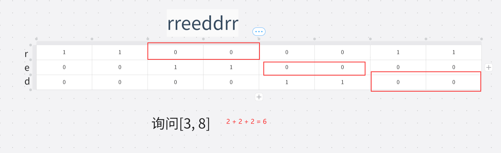

# 牛客周赛 Round 41

**B.小红的排列构造**

https://ac.nowcoder.com/acm/contest/80742/B

定义两个数组$a$和$b$的汉明距离为：有多少个下标$i$满足$a_i≠b_i$。例如，$[2,3,1]$和$[1,3,1]$的汉明距离是$1$。
 现在小红拿到了一个长度为$n$的排列$p$，她希望你构造一个长度为$n$的排列$q$，满足$p$和$q$的汉明距离恰好等于$k$。

 排列指长度为$n$的数组，其中$1$到$n$每个元素恰好出现了一次

> 若$k > n $ 或者$k=1$，显然无解。
>
> 因为每个元素都只出现一次，交换两个无汉明距离的元素必定产生增加汉明距离， 交换一个有汉明距离的元素和一个无汉明距离的元素必定增加一个汉明距离。
>
> 遍历序列，设第$i$个数为$a_i$，不断让$a_i$和$a_{i+1}$交换，交换$k-1$次即可。
>
> ——第一次交换产生 2 个距离，后面每一次产生 1 个距离。

```java
import java.util.*;
public class Main {
    static Scanner s = new Scanner(System.in);
    static int n, k, a[];
    public static void main(String[] args){
    	n = s.nextInt();
    	k = s.nextInt();
    	a = new int[n];
    	if(k > n || k == 1) {
    		System.out.print(-1);
    		return;
    	}
    	for(int i = 0; i<n; i++) a[i] = s.nextInt();
    	for(int i = 0; i<=k - 2; i++) {
    		int t = a[i];
    		a[i] = a[i + 1];
    		a[i + 1] = t;
    	}
    	for(int i = 0; i<n; i++) System.out.print(a[i] + " ");
    }
}
```

**C. 小红的循环移位**

https://ac.nowcoder.com/acm/contest/80742/C

小红拿到了一个数字串，她每次操作可以使得其向左循环移动一位。
 将串 $s=s_0s_1...s_{n−1}$​ 向左循环移动一位，将得到串$s_1...s_{n−1}s_0$
 小红想知道，使得该数字串变成4的倍数，需要最少操作多少次？（可以包含前导零）

> 枚举一下 4 的倍数：4  8  **12  16  20  24  28  32  36  40 44 ......**
>
> 发现规律：若数字位数大于1位，若个位数字为 2/6且高一位为奇数，则为4的倍数；若个位数字为4/8/0且高一位为偶数，则为4的倍数。
>
> 有了该规律就可以遍历一遍的情况下找出最小操作次数。
>
> 1. 特判一下一位数
> 2. 先判断 0 次操作是否可行。
> 3. 再判断$1 \sim n-1$次操作，设$a_i$为从左往右第$i$位数字，若$a_i$与$a_{i - 1}$满足规律，则需要操作$i$次
> 4. 若都不行则输出$ - 1$
>
> 时间复杂度：$O(n)$

```java
import java.util.*;
public class Main {
    static Scanner s = new Scanner(System.in);
    public static void main(String[] args){
    	String num = s.next();
    	int n = num.length();   	
    	//特判 一位数
    	if(n == 1) {
    		int x = num.charAt(0) - '0';
    		if(x == 4 || x == 8) {
    			System.out.print(0);return;
    		}else {
    			System.out.print(-1);return;
    		}
    	}
    	// 0 次操作
    	int a = num.charAt(n - 2) - '0';
		int b = num.charAt(n - 1) - '0';
		if(isVlid(a, b)) {System.out.print(0);return;}
		// 1 ~ n - 1次操作
    	for(int i = 0; i<=n - 2; ++ i) {
     		a = num.charAt(i - 1 < 0 ? n - 1 : 0) - '0';//
    		b = num.charAt(i) - '0';
    		if(isVlid(a, b)) {
    			System.out.print(i + 1);return;
    		}
    	}
    	System.out.print(-1);
    }
    public static boolean isVlid(int a, int b) {
    	if(a % 2 == 0) {
			if(b == 4 || b == 8 || b == 0) {
				return true;
			}
		}else {
			if(b == 2 || b == 6) {
				return true;
			}
		}
    	return false;
    }
}
```

D. 小红的好串

https://ac.nowcoder.com/acm/contest/80742/D

小红定义一个字符串是“好串”，当且仅当该该字符串在长度和它相等的字符串中，"red"子序列的数量是最多的。
 例如，"rreedd"是好串，因为包含了8个"red"子序列。而"redred"则不是好串。

 现在小红拿到了一个字符串，她有多次询问，每次询问一个区间，你需要回答将该区间对应的子串修改为好串的最小修改次数（每次修改可以修改任意一个字符）

> 用三个前缀和记录记录每个字母的出现情况，在比较时用前缀和计算。
>
> 对于好串的形式，应当让三个字母数量尽可能接近。当长度不是三的倍数时应当讨论三种情况。
>
> $O(n + m)$



```java
import java.io.*;
import java.util.*;

public class Main {
    static Scanner sc = new Scanner(System.in);
    static PrintWriter pw = new PrintWriter(new BufferedWriter(new OutputStreamWriter(System.out)));
    static int n, m, l , r, s[][];
    static char[] c;  
    public static void main(String[] args) throws Exception {
        n = sc.nextInt();
        m = sc.nextInt();
        c = sc.next().toCharArray();
        s = new int[n + 1][3];
        for(int i = 1; i <= n; i ++){
            s[i][getc(c[i - 1])] ++;
            for(int j = 0; j < 3; j ++) s[i][j] += s[i - 1][j];
        }
        while(m --> 0){
            l = sc.nextInt();
            r = sc.nextInt();
            int d = r - l + 1;
            if(d <= 2) {
                pw.println(0);
                continue;
            }
            int ans = (int) 1e9;
            int len = d / 3;
            if(d % 3 == 0){
                int k1 = l + len - 1, k2 = l + 2 * len - 1;
                ans = d - get(k1, k2); 
            }else if(d % 3 == 1){
                int k1 = l + len - 1, k2 = l + 2 * len - 1;
                ans = d - get(k1, k2);
                k2 ++;
                ans = Math.min(ans, d - get(k1, k2));
                k1 ++;
                ans = Math.min(ans, d - get(k1, k2));
            }else{
                int k1 = l + len, k2 = k1 + len + 1;
                ans = d - get(k1, k2);
                k2 --;
                ans = Math.min(ans, d - get(k1, k2));
                k1 --;
                ans = Math.min(ans, d - get(k1, k2));
            }
            pw.println(ans);
        }
        pw.flush();pw.close(); 
    }
    public static int get(int k1, int k2){
        return s[k1][0] - s[l - 1][0] + s[k2][1] - s[k1][1] + s[r][2] - s[k2][2];
    }
    public static int getc(char c){
        if(c == 'r') return 0;
        if(c == 'e') return 1;
        return 2;
    }
}

```

# ✅牛客周赛 Round 46

[C-爱音开灯](https://ac.nowcoder.com/acm/contest/84444/C)

有无穷个灯排成一排，编号为从 1 开始，初始时所有灯都是关闭的。改变第 i 个灯的开闭状态会同时改变所有编号为 iii 倍数的灯的开闭状态。
 Anon会从 1 到 n ，依次改变每一个灯的开闭状态，她想知道第 x 个灯最终的状态是什么？如果灯是关闭的，输出 "OFF" ，否则输出 "ON" 。

> 约数

> 枚举$x$的因数，判断有多少次在$n$以内即该点被操作多少次
>
> $O(\sqrt n)$

```java
import java.io.*;
import java.util.*;
public class Main {
    static Scanner sc = new Scanner(System.in);
    static PrintWriter pw = new PrintWriter(new BufferedWriter(new OutputStreamWriter(System.out)));
    static long n, x;
    public static void main(String[] args) throws Exception {
        int cnt = 0;
        n = sc.nextLong();
        x = sc.nextLong();
        for(int i = 1; i < x / i; i ++){
            if(x % i == 0){
                if(i <= n) cnt ++;
                if(x / i <= n) cnt ++;
            }
        }
        //这里不要算两次了
        if(x % Math.sqrt(x) == 0 && Math.sqrt(x) <= n) cnt ++;
        pw.println(cnt % 2 == 0 ? "OFF" : "ON");
        pw.flush();
        pw.close(); 
    }
}
```

[D-小灯做题](https://ac.nowcoder.com/acm/contest/84444/D)

> 分类讨论
>
> $mex(x,y) \in \{0, 1, 2\}$
>
> 先过滤0步的情况
>
> a	b	c
>
> **a	b	1|a	b	0**	
>
> a	0	1
>
> 2	0	1

```java
import java.io.*;
import java.util.*;
public class Main {
    static Scanner sc = new Scanner(System.in);
    static PrintWriter pw = new PrintWriter(new BufferedWriter(new OutputStreamWriter(System.out)));
    static int T, a, b, c, k;
    public static void main(String[] args) throws Exception {
        T = sc.nextInt();
        while(T --> 0){
            a = sc.nextInt();
            b = sc.nextInt();
            c = sc.nextInt();
            k = sc.nextInt();
            Set<Integer> s = new HashSet<>();
            s.add(a);s.add(b);s.add(c);
            int ans = -1;
            if(s.contains(k)) ans = 0;
            else if(k == 0) ans = 1;
            else if(k == 1){
                if(s.contains(0)) ans = 1;
                else ans = 2;
            }
            else if(k == 2){
                if(s.contains(0) && s.contains(1)){
                    ans = 1;
                }else if(!s.contains(0) && !s.contains(1)){
                    ans = 3;
                }else{
                    ans = 2;
                }
            }
            pw.println(ans);            
        }
        pw.flush();
        pw.close(); 
    }
}
 
```

[E-立希喂猫](https://ac.nowcoder.com/acm/contest/84444/E)

Taki买了 n 种猫粮，第 i 种猫粮的营养值为 $a_i$ 、数量为 $b_i$ 。
 猫猫的饭量是无穷的，每一天她可以吃任意数量的猫粮，但是同一种猫粮她一天只会吃一次。
 Taki想知道在 k 天内，猫猫可以获得的最大营养值之和是多少

> **前缀和、二分、贪心**

> 对于每一天把还剩有的猫粮全部吃一遍，对于第$k$天，数量小于等于$k$的将被全部吃完，大于$k$的将被吃$k$次。
>
> 将猫粮按数量排序，二分查找出分界点，用两个前缀和计算两部分营养即可。

```java
import java.io.*;
import java.util.*;
public class Main {
    static Scanner sc = new Scanner(System.in);
    static PrintWriter pw = new PrintWriter(new BufferedWriter(new OutputStreamWriter(System.out)));
    static int n;
    static long a[][], s1[], s2[], q, k;
    public static void main(String[] args) throws Exception {
        n = sc.nextInt();
        a = new long[n + 1][2];
        s1 = new long[n + 1];
        s2 = new long[n + 1];
        for(int i = 1; i <= n; i ++) a[i][0] = sc.nextInt();
        for(int i = 1; i <= n; i ++) a[i][1] = sc.nextInt();
        Arrays.sort(a, (o1, o2) -> (int)(o1[1] - o2[1]));
        for(int i = 1; i <= n; i ++){
            s1[i] = s1[i - 1] + a[i][0] * a[i][1];
            s2[i] = s2[i - 1] + a[i][0];
        }
        q = sc.nextInt();
        while(q --> 0){
            k = sc.nextInt();
            int l = 0, r = n, idx = l;
            while(l <= r){
                int m = (l + r) >> 1;
                if(a[m][1] <= k){
                    idx = m;
                    l = m + 1;
                }else{
                    r = m - 1;
                }
            }
            pw.println( s1[idx] + k * (s2[n] - s2[idx]) );
        }

        pw.flush();
        pw.close(); 
    }
}
```

[F-祥子拆团](https://ac.nowcoder.com/acm/contest/84444/F)             

有两个数字 $x,y$ ，有多少种方式可以将 $x$ 拆成 $y$ 个正整数的乘积。
 例如 $x=6,y=2$ 时，有$6 \times 1=6,3 \times 2=6,2 \times 3=6,1 \times 6=6$ 这 4 种方法。
 由于这个答案可能很大，因此你需要输出答案对 $10^9 + 7$ 取模后的结果。

> **组合数学、快速幂、逆元**

> 考虑将$x$分解质因数，对于**每种**质因数（设这种质因数有$d$个）相当于放入$y$个盒子中且允许有空盒子，对应**插板法的第二类问题**，答案为$C_{d+y-1}^{y-1}=C_{d+y-1}^{d}$，由于$d$的值很小不会超过30，所以用循环计算组合数。
>
> $\frac{(d+y-1)\times(d+y-2)\times...\times y}{d\times(d-1)\times...\times1}$，$d$从$d$到$1$。
>
> 每种质因数放入盒子相当于一个步骤，根据乘法原理，需要将每种质因数的答案相乘。

```java
import java.io.*;
import java.util.*;

public class Main {
    static Scanner sc = new Scanner(System.in);
    static PrintWriter pw = new PrintWriter(new BufferedWriter(new OutputStreamWriter(System.out)));
    static int N = 100010, T, a, b, mod = (int)1e9 + 7;
    public static void main(String[] args) throws Exception {
        T = sc.nextInt();
        while(T --> 0){
            a = sc.nextInt();
            b = sc.nextInt();
            long ans = 1;
            for(int i = 2; i <= a / i; i ++){
                if(a % i == 0){
                    int s = 0;
                    while(a % i == 0){
                        s ++;
                        a /= i;
                    }
                    //s个相同质因子放入b个盒子 => c(s + b - 1, s)
                    for(int k = s; k >= 1; k --){
                        ans = ans * (b - 1 + k) % mod;
                        ans = ans * qpow(k, mod - 2) % mod;
                    }
                }
            }
            if(a > 1)  ans = ans * b % mod;
            pw.println(ans);
        }
        pw.flush();
        pw.close(); 
    }
    private static long qpow(long a, long n) {
        a %= mod;
        long ans = 1;
        while(n > 0){
            if((n & 1) == 1) ans = ans * a % mod;
            a = a * a % mod;
            n >>>= 1;
        }
        return ans;
    }
}
```

# 牛客周赛 Round 48

[B-小红的伪回文子串（easy）](https://ac.nowcoder.com/acm/contest/85187/B)

定义一个字符串的“伪回文值”是：修改最少字符数量使得其变成回文串的修改次数。例如，"abca"的伪回文值是1。任何回文串的伪回文值是0。

给定一个字符串，求出所有连续子串的伪回文值之和。(长度不超过100)

> 枚举|区间dp

> 法一：枚举所有字串，用双指针从两边判断需要修改多少个字符才能变为回文串。
>
> ​			$O(n^3)$
>
> 法二：$dp[i][j]$：表示$i\sim j$字串的伪回文值
>
> ​			若$a[i] = a[j], dp[i][j] = d[i + 1][j -1]$
>
> ​			否则，$dp[i][j] = dp[i+1][j -1] + 1$
>
> ​			枚举所有字串，求和得答案。
>
> ​			$O(n^2)$
>
> 法三：计算每一对字符对答案的贡献。
>
> ​			(从0开始)位置为$i，j$是多少个字串的对称位置呢？$min(i + 1, n - j)$个。
>
> ​			如果$a[i]\neq a[j] $，则该对字符对答案的贡献为$min(i + 1,n-j)$.
>
> ​			枚举所有字符对，求和贡献。
>
> ​			$O(n^2)$

```java
import java.io.*;
import java.util.*;

public class Main {
    static Scanner sc = new Scanner(System.in);
    static PrintWriter pw = new PrintWriter(new BufferedWriter(new OutputStreamWriter(System.out)));
    public static void main(String[] args) throws Exception {
        char[] s = sc.next().toCharArray();
        int n = s.length;
        long ans = 0;
        for(int i = 0; i < n - 1; i ++){
            for(int j = i + 1; j < n; j ++){
                for(int l = i, r = j; l < r; l ++, r --){
                    if(s[l] != s[r]) ans ++;
                }
            }
        }
        pw.println(ans);
        pw.flush();pw.close(); 
    }
}
--------------------------------------------------------------------------------------
import java.io.*;
import java.util.*;

public class Main {
    static Scanner sc = new Scanner(System.in);
    static PrintWriter pw = new PrintWriter(new BufferedWriter(new OutputStreamWriter(System.out)));
    public static void main(String[] args) throws Exception {
        char[] s = sc.next().toCharArray();
        int n = s.length;
        int dp[][] = new int[n + 1][n + 1];
        long ans = 0;
        for(int j = 2; j <= n ; j ++){
            for(int i = 1; i <= j - 1; i ++){// left:i right:j
                if(s[j - 1] == s[i - 1])  dp[i][j] = dp[i + 1][j - 1];
                else dp[i][j] = dp[i + 1][j - 1] + 1;
                ans += dp[i][j];
            }
        }
        pw.println(ans);
        pw.flush();pw.close(); 
    }
}
------------------------------------------------------------------------------
import java.io.*;
import java.util.*;

public class Main {
    static Scanner sc = new Scanner(System.in);
    static PrintWriter pw = new PrintWriter(new BufferedWriter(new OutputStreamWriter(System.out)));
    public static void main(String[] args) throws Exception {
        char[] c = sc.next().toCharArray();
        int n = c.length;
        long ans = 0;
        for(int i = 0; i < n - 1; i ++){
            for(int j = i + 1; j < n; j ++){
                if(c[i] != c[j]) ans += Math.min(i + 1, n - j);
            }
        }
        pw.println(ans);
        pw.flush();pw.close(); 
    }
}
```

[E-小红的伪回文子串（hard）](https://ac.nowcoder.com/acm/contest/85187/E)

定义一个字符串的“伪回文值”是：修改最少字符数量使得其变成回文串的修改次数。例如，"abca"的伪回文值是1。任何回文串的伪回文值是0。

给定一个字符串，求出所有连续子串的伪回文值之和。(**长度不超过200000**)

> 由easy版的法三拓展。

```java
import java.io.*;
import java.util.*;

public class Main {
    static Scanner sc = new Scanner(System.in);
    static PrintWriter pw = new PrintWriter(new BufferedWriter(new OutputStreamWriter(System.out)));
    public static void main(String[] args) throws Exception {
        char[] c = sc.next().toCharArray();
        int n = c.length;
        long cnt[][] = new long[n + 1][26];
        long sum[][] = new long[n + 1][26];
        long s[] = new long[n + 1];
        for(int i = 1; i <= n; i ++){
            s[i] = s[i - 1] + n - i + 1;
            cnt[i][c[i - 1] - 'a'] = 1;
            sum[i][c[i - 1] - 'a'] = n - i + 1;
            for(int j = 0; j < 26; j ++){
                cnt[i][j] += cnt[i - 1][j];
                sum[i][j] += sum[i - 1][j];
            }
        }
        long ans = 0;
        for(int i = 1; i <= n; i ++){
            int x = c[i - 1] - 'a';
            if(i <= n / 2){
                ans += (n - 2 * i - (cnt[n - i][x] - cnt[i][x])) * i;
                ans += s[n] - s[n - i] - (sum[n][x] - sum[n - i][x]);
            }else{
                ans += s[n] - s[i] - (sum[n][x] - sum[i][x]);
            }
        }
        pw.println(ans);
        pw.flush();pw.close(); 
    }
}
```

# 牛客周赛 Round 50

[D-小红的因式分解](https://ac.nowcoder.com/acm/contest/85687/D)

小红有三个整数 $a,b,c$，要将 $ax^2+bx+c$分解为 $(a_1x+b_1)(a_2x+b_2)$ 的形式，其中 $a_1,b_1,a_2,b_2$ 均为整数。如果可以分解，请按 $a_1,b_1,a_2,b_2$的顺序输出，若有多解输出任意一种，若无解，输出 "NO"。

> 数学、枚举

> 法一 ： 枚举
>
> 枚举所有相乘等于$a$的$a_1,a_2$数对，和相乘等于$b$的$b_1,b_2$数对。判断里面是否有$a_1\times b_2 + a_2 \times b_1=b$的情况。
>
> 法二：解方程
>
> 从方程的解出发。若delta小于0则无解，再用求根公式计算方程的解的分子分母是否为整数。若为整数求解出最简分数形式，再计算$a_1\times a_2 和a$的倍数差，再乘上倍数。
>
> **注意**：计算delta的时候会超`int`

```java
import java.io.*;
import java.util.*;

public class Main {
    static Scanner sc = new Scanner(System.in);
    static PrintWriter pw = new PrintWriter(new BufferedWriter(new OutputStreamWriter(System.out)));
    static int a, b, c;
    public static void solve(){
        a = sc.nextInt();
        b = sc.nextInt();
        c = sc.nextInt();
        // if(b * b - 4 * a * c < 0) pw.println("NO");
        // else{
            if(c==0) {
                pw.println(1 + " " + 0 + " " + a + " " + b);
                return;
            }
            Vector<int[]> p = new Vector<>();
            Vector<int[]> q = new Vector<>();
            for(int i = 1; i * i <= Math.abs(a); i ++){
                if(Math.abs(a) % i == 0){
                    p.add(new int[]{i, a / i});
                    p.add(new int[]{a / i, i});
                    p.add(new int[]{-i, -a / i});
                    p.add(new int[]{-a / i, -i});
                }
            }
            for(int i = 1; i * i <= Math.abs(c); i ++){
                if(Math.abs(c) % i == 0){
                    q.add(new int[]{i, c / i});
                    q.add(new int[]{c / i, i});
                    q.add(new int[]{-i, -c / i});
                    q.add(new int[]{-c / i, -i});
                }
            }
            for(int[] A : p){
                for(int[] B : q){
                    if(1l * A[0] * B[1] +  1l * A[1] * B[0] == b){
                        pw.println(A[0] + " " + B[0] + " " + A[1] + " " + B[1]);
                        return;
                    }
                }
            }            
            pw.println("NO");
        }
    // }
    public static void main(String[] args) throws IOException {
        int T = sc.nextInt();
        while(T --> 0) solve();
        pw.flush();pw.close();
    }
}
----------------------------------------------------------------------
import java.io.*;
import java.util.*;

public class Main {
    static Scanner sc = new Scanner(System.in);
    static PrintWriter pw = new PrintWriter(new BufferedWriter(new OutputStreamWriter(System.out)));
    static int a, b, c;
    public static void solve(){
        a = sc.nextInt();
        b = sc.nextInt();
        c = sc.nextInt();
        long d = 1l * b * b - 4l * a * c;
        if(d < 0){
            pw.println("NO");
            return;
        }
        long sq = (long)Math.sqrt(d);
        if(sq * sq != d){
            pw.println("NO");
            return;
        }
        long a1 = 2 * a;
        long b1 = b - sq;
        long a2 = 2 * a;
        long b2 = b + sq;
        long g1 = gcd(a1, b1);
        long g2 = gcd(a2, b2);
        a1 /= g1;
        b1 /= g1;
        a2 /= g2;
        b2 /= g2;
        long dd = a / a1 / a2;
        a1 *= dd;
        b1 *= dd;
        pw.println(a1 + " " + b1 + " " + a2 + " " + b2);
    }
    public static long gcd(long a, long b){
        return b == 0 ? a : gcd(b, a % b);
    }
    public static void main(String[] args) throws IOException {
        int T = sc.nextInt();
        while(T --> 0) solve();
        pw.flush();pw.close();
    }
}
```

[E-小红的树上移动](https://ac.nowcoder.com/acm/contest/85687/E)

小红有一棵 $n$ 个点的树，根节点为 1，有一个物块在根节点上，每次它会等概率随机移动到当前节点的其中一个子节点，而后等概率随机传送到一个同深度节点，若此时它位于叶子节点，则停止移动。
 求其移动到子节点的次数的期望值，答案对 $998244353$取模。

> 期望、概率，dfs，快速幂，逆元。

> 注意这句话“每次它会等概率随机移动到当前节点的其中一个子节点，而后等概率随机传送到一个同深度节点”
>
> 代表从一层移动下一层的每个点的概率相同。
>
> 用dfs统计每一层有多少节点和多少叶子节点。
>
> 对于**每一层的期望**为到达这一层的叶子节点的概率乘以这一层的深度（定义根节点深度为0），**到达这一层的的叶子节点的概率**为到上一层非叶子节点的概率乘以这一层叶子节点的占比。

```java
import java.io.*;
import java.util.*;

public class Main {
    static Scanner sc = new Scanner(System.in);
    static PrintWriter pw = new PrintWriter(new BufferedWriter(new OutputStreamWriter(System.out)));
    static int n, u, v, lay[], yz[], mod = 998244353;
    static Vector<Integer>[] adj;
    public static long qpow(long a,long n){
        a %= mod;
        long ans = 1;
        while(n > 0){
            if(n % 2 == 1) ans = ans * a % mod;
            a = a * a % mod;
            n >>>= 1;
        }
        return ans;
    }
    public static void main(String[] args) throws IOException {
        n = sc.nextInt();
        adj = new Vector[n + 1];
        lay = new int[n + 2];
        yz = new int[n + 2];
        Arrays.setAll(adj, i -> new Vector<>());        
        for(int i = 1; i < n; i ++){
            u = sc.nextInt();
            v = sc.nextInt();
            adj[u].add(v);
        }
        dfs(1, 1);
        long ans = 0, p = 1;
        for (int i = 1; i <= n; i++) {
            // pw.print(lay[i] + " " + yz[i] + "\n");
            ans = (ans + p * yz[i] % mod * qpow(lay[i], mod - 2) % mod * (i - 1)) % mod;
            p = p * (lay[i] - yz[i]) % mod * qpow(lay[i], mod - 2) % mod;
        }
        pw.println(ans);
        pw.flush();pw.close();
    }
    public static void dfs(int u, int c){
        lay[c] ++;
        if(adj[u].size() == 0) yz[c] ++;
        for(int v : adj[u]){
            dfs(v, c + 1);
        }
    }
}
```

# [牛客周赛 Round 53](https://ac.nowcoder.com/acm/contest/86387)

[D-小红组比赛_“葡萄城杯”牛客周赛 Round 53 (nowcoder.com)](https://ac.nowcoder.com/acm/contest/86387/D)

有$n$行数，每行$m$个，在其中每行选一个数使得与$target$最接近，输出最小相差多少。

$1\le n \le100,1\le m\le20\\1\le a_{i,j}\le50\\1\le target\le5000$

> dp

> $dp[i][x]$：选$i$个数是否能获得值$x$
>
> 转移：$dp[i][x] |=dp[i-1][x-a[i][j]]$，能否获得$x$和上一行能否获得$x-a[i][j]$有关
>
> 注意：转移时用 `|=` 不能直接用 `=` ，因为同一行选不同数时会可能会转移出相同$x$值；如果直接赋值，若靠前的可以转移出该$x$，靠后的不能转移出$x$，那么之前的结果就会被不能转移出覆盖，导致错误。所以用`|=`保证已经转移出的结果保留。
>
> 转移出第$n$行能够获得的数据之后，遍历一遍记录与$target$最小的差值。

> $O(n\times m\times target)$

```java
import java.io.*;
import java.util.*;

public class Main {
    static Scanner sc = new Scanner(System.in);
    static PrintWriter pw = new PrintWriter(new BufferedWriter(new OutputStreamWriter(System.out)));
    static int n, m, a[][], t;
    static boolean dp[][];
    public static void main(String[] args) throws IOException {
        n = sc.nextInt();
        m = sc.nextInt();
        a = new int[n + 1][m];
        dp = new boolean[n + 1][100010];
        for(int i = 1; i <= n; i ++)
            for(int j = 0; j < m; j ++)
                a[i][j] = sc.nextInt();
        t = sc.nextInt();
        dp[0][0] = true;
        for(int i = 1; i <= n; i ++)
            for(int j = 0; j < m; j ++)
                for(int x = a[i][j]; x <= 5000; x ++)
                    dp[i][x] |= dp[i - 1][x - a[i][j]];
        int ans = (int)1e9;
        for(int x = 0; x < dp[n].length; x ++){
            if(dp[n][x]) ans = Math.min(ans, Math.abs(t - x));
        }
        pw.println(ans);
        pw.flush();pw.close();
    }
}
```

[E-折半丢弃_“葡萄城杯”牛客周赛 Round 53 (nowcoder.com)](https://ac.nowcoder.com/acm/contest/86387/E)

> 二分答案

> 小于等于最大mex的都可以满足，而大于最大mex的不能满足，所以可以二分mex再验证该mex是否满足。
>
> 验证二分的mex是否满足：对于所有大于mex的值，将其不断除以2，直到小于该mex且没有出现过的值时停止。如果一直除到0也没有遇见还没出现过的数，也停止。最后判断mex之前是否有mex个数即可。

> $O(n\log^2 n)$

```java
import java.io.*;
import java.util.*;

public class Main {
    static Scanner sc = new Scanner(System.in);
    static PrintWriter pw = new PrintWriter(new BufferedWriter(new OutputStreamWriter(System.out)));
    static int n, a[];
    public static boolean check(int m){
        Set<Integer> set = new HashSet<>();
        boolean vis[] = new boolean[m];
        for(int i = 0; i < n; i ++){
            int t = a[i];
            while(t >= m || (t > 0 && set.contains(t))) t /= 2;
            set.add(t);
        }
        return set.size() == m;
    }
    public static void solve(){
        n = sc.nextInt();
        a = new int[n];
        for(int i = 0; i < n; i ++) a[i] = sc.nextInt();
        int l = 1, r = n + 1, ans = 0;
        while(l <= r){
            int m = (l + r) >>> 1;
            if(check(m)){
                ans = m;
                l = m + 1;
            }else{
                r = m - 1;
            }
        }
        pw.println(ans);
    }
    public static void main(String[] args) throws IOException {
        int T = sc.nextInt();
        while(T --> 0) solve();
        pw.flush();pw.close();
    }
}
```

[F-小红走矩阵_“葡萄城杯”牛客周赛 Round 53 (nowcoder.com)](https://ac.nowcoder.com/acm/contest/86387/F)

​		$n×m$ 的矩阵由障碍和空地组成，初始时小红位于起点 $(1, 1)$ ，她想要前往终点 $(n,m)$。小红每一步可以往上下左右四个方向的空地移动一格。
​		小红在起点处可以进行最多一次操作：选择矩阵中的一处障碍替换为空地，但代价是小红必须选择失去向上下左右四个方向中一个移动的能力。
​		求小红从起点到达终点的最小步数，如果无法到达则输出 −1

> BFS

> 状态存储：$[x,y,step,ban,k]$表示坐标、步数、不能走的方向、还能穿过的障碍数。
>
> $vis$数组防止重复搜索：$[x,y,ban,k]$记录是否被搜索过。

> $O(n\times m \times 5\times 2)$

```java
import java.io.*;
import java.util.*;

public class Main {
    static Scanner sc = new Scanner(System.in);
    static PrintWriter pw = new PrintWriter(new BufferedWriter(new OutputStreamWriter(System.out)));
    static int n, m;
    static char[][] c;
    static boolean vis[][][][];
    static int dx[] = {1, -1, 0, 0}, dy[] = {0, 0, 1, -1};
    public static void main(String[] args) throws IOException {
        n = sc.nextInt();
        m = sc.nextInt();
        c = new char[n][];
        vis = new boolean[n][m][5][2];
        for(int i = 0; i < n; i ++){
            c[i] = sc.next().toCharArray();
        }
        int ans = -1;
        // x y step ban k
        Queue<int[]> que = new LinkedList<>();
        que.add(new int[]{0, 0, 0, 0, 1});
        que.add(new int[]{0, 0, 0, 1, 1});
        que.add(new int[]{0, 0, 0, 2, 1});
        que.add(new int[]{0, 0, 0, 3, 1});
        que.add(new int[]{0, 0, 0, 4, 0});
        while(!que.isEmpty()){
            int p[], x, y, step, ban, k;
            p = que.poll();
            x = p[0]; y = p[1]; step = p[2]; ban = p[3]; k = p[4];            
            if(x < 0 || x >= n || y < 0 || y >= m) continue;
            if(vis[x][y][ban][k]) continue;
            if(c[x][y] == 'X' && k == 0) continue;
            vis[x][y][ban][k] = true;
            if(x == n - 1 && y == m - 1){
                ans = step;
                break;
            }
            if(c[x][y] == 'X') k = 0;
            for(int i = 0; i < 4; i ++){
                if(i == ban) continue;
                que.add(new int[]{x + dx[i], y + dy[i], step + 1, ban, k});
            }

        }
        pw.println(ans);
        pw.flush();pw.close();
    }
}
```

# 牛客周赛 Round 54（exc: E F）

[D-清楚姐姐跳格子_牛客周赛 Round 54 (nowcoder.com)](https://ac.nowcoder.com/acm/contest/87303/D)

清楚正在玩跳格子游戏。地上有 n 个格子，清楚一开始在 1 号格子，目标是 n 号格子。

第 $i$ 个格子上有一个数字 $a_i$ ，清楚在这个格子上可以往左右两边选一个方向，然后选择 $a_i$ 的一个正整数因子作为长度，进行一次跳跃，但是不可以跳出边界。
请问清楚最少跳多少步，就可以到达 $n$ 号格子。

> 最短路

> 对于每个数我们求解他的因数距离是哪些格子并不好操作，我们反过来枚举格子距离判断是否是他的因数。
>
> 法一：BFS，标记已经搜索过的地方，防止重复搜索。
>
> 法二：用朴素版的dijkstra。

> $O(???)$
>
> $O(n^2)$

```java
import java.io.*;
import java.util.*;

public class Main {
    static Scanner sc = new Scanner(System.in);
    static PrintWriter pw = new PrintWriter(new BufferedWriter(new OutputStreamWriter(System.out)));
    static int n, d[];
    static long a[];
    public static void solve(){
        n = sc.nextInt();
        a = new long[n + 1];
        d = new int[n + 1];
        for(int i = 1; i <= n; i ++) a[i] = sc.nextLong();
        Arrays.fill(d, -1);
        Queue<int[]> que = new LinkedList<>();
        que.add(new int[]{1, 0});
        d[1] = 0;
        while(!que.isEmpty()){
            int p[] = que.poll();
            int t = p[0];
            int step = p[1];
            if(t == n){
                pw.println(step);
                return;
            }
            for(int i = (int) Math.max(0, t - a[t]); i <= Math.min(n, t + a[t]); i ++){
                if(d[i] == -1 && a[t] % Math.abs(i - t) == 0){
                    d[i] = step + 1;
                    que.add(new int[]{i, step + 1});
                }
            }
        }
    }
    public static void main(String[] args) throws IOException {     
        solve();
        pw.flush();pw.close();
    }  
}
//--------------------------------------------------------------

import java.io.*;
import java.util.*;

public class Main {
    static Scanner sc = new Scanner(System.in);
    static PrintWriter pw = new PrintWriter(new BufferedWriter(new OutputStreamWriter(System.out)));
    static int n, d[];
    static long a[];
    static boolean st[];
    public static void solve(){
        n = sc.nextInt();
        a = new long[n + 1];
        d = new int[n + 1];
        st = new boolean[n + 1];
        for(int i = 1; i <= n; i ++) a[i] = sc.nextLong();
        Arrays.fill(d, (int)1e9);
        d[1] = 0;
        for(int i = 0; i < n; i ++){
            int t = -1;
            for(int j = 1; j <= n; j ++){
                if(!st[j] && (t == -1 || d[j] < d[t])) t = j;
            }
            st[t] = true;
            for(int j = (int) Math.max(0, t - a[t]); j <= Math.min(n, t + a[t]); j ++){
                if(!st[j] && a[t] % Math.abs(j - t) == 0) d[j] = Math.min(d[j], d[t] + 1);
            }
        }
        pw.println(d[n]);
    }
    public static void main(String[] args) throws IOException {     
        solve();
        pw.flush();pw.close();
    }
}
```

# ✅牛客周赛 Round 60

[D-我们N个真是太厉害了_牛客周赛 Round 60 (nowcoder.com)](https://ac.nowcoder.com/acm/contest/90070/D)

给定$n$个数$a_1,a_2,...,a_n$，能否选取其中一些数加起来表示出$1\sim n$的每一个数。若不能输出最小的不能表示的数，若能输出`Cool!`$2\le n\le10^5$

> 用`dp[i]`表示前`i`个数能表示到的最大范围数。对于`a[i]`如果`a[i] <= dp[i - 1] + 1`那么就能无缝衔接上`dp[i - 1]`一直到`dp[i - 1] + a[i]`，如果`a[i] > dp[i - 1] + 1`那么`dp[i - 1] + 1` 这个数就永远凑不出来了。

```java
    public static void solve() throws IOException{     
        int n = rd.nextInt();
        int a[] = new int[n + 1];
        for(int i = 1; i <= n; i ++) a[i] = rd.nextInt();
        Arrays.sort(a);

        long dp[] = new long[n + 1];
        for(int i = 1; i <= n; i ++){
            if(a[i] > dp[i - 1] + 1){
                pw.println(dp[i - 1] + 1);
                return;
            }else{
                dp[i] = dp[i - 1] + a[i];
            }
            if(dp[i] >= n) break;
        }
        pw.println("Cool!");
    }
```

[E-折返跑_牛客周赛 Round 60 (nowcoder.com)](https://ac.nowcoder.com/acm/contest/90070/E)

> **组合数学** $C_{n -2}^{m - 1}$
>
> 其中有$m - 1$次需要推杆，需要在两杆之间$n-2$个位置中选取$m-1$个落脚点

[F-口吃_牛客周赛 Round 60 (nowcoder.com)](https://ac.nowcoder.com/acm/contest/90070/F)

> **期望dp 推公式**
>
> $f_i$：从第$i$个字开始讲完这句话的期望
>
> 这样转移：$f_i = P_if_{i+1}+Q_i$
>
> $f_1=\frac{a_1}{a_1+b_1}f_2+\frac{b_1}{a_1+b_1}f_1 + 1 \rightarrow f_1=f_2+\frac{a_1+b_1}{a_1}$    $P_1=1,Q_1=\frac{a_1+b_1}{a_1}$
>
> $f_2=\frac{a_2^2}{(a_2+b_2)^2}f_3+\frac{2a_2b_2}{(a_2+b_2)^2}f_2+\frac{a_2^2}{(a_2+b_2)^2}f_3+1\rightarrow f_2=\frac{a_2^2}{a_2^2+b_2^2-b_2^2P_1}f_3+\frac{b_2^2Q_1+(a_2+b_2)^2}{a_2^2+b_2^2-b_2^2P_1}$
>
> $P_2=\frac{a_2^2}{a_2^2+b_2^2-b_2^2P_1},Q_2=\frac{b_2^2Q_1+(a_2+b_2)^2}{a_2^2+b_2^2-b_2^2P_1}$可以推广为$P_i=\frac{a_i^2}{a_i^2+b_i^2-b_i^2P_{i-1}},Q_i=\frac{b_i^2Q_{i-1}+(a_i+b_i)^2}{a_i^2+b_i^2-b_i^2P_{i-1}}$
>
> 正推`P[] Q[]`，逆推`f[]`

```java
    static int mod = (int)1e9 + 7;
    public static void solve() throws IOException{     
        int n = rd.nextInt();
        long a[] = new long[n];
        long b[] = new long[n];
        for(int i = 1; i <= n - 1; i ++) a[i] = rd.nextInt();
        for(int i = 1; i <= n - 1; i ++) b[i] = rd.nextInt();
        long P[] = new long[n];
        long Q[] = new long[n];
        P[1] = 1; Q[1] = (b[1] * pow(a[1], mod - 2) + 1) % mod;
        for(int i = 2; i <= n - 1; i ++){
            P[i] = pow(a[i], 2) * pow( (pow(a[i], 2) + pow(b[i], 2) + mod - pow(b[i], 2) * P[i - 1] % mod) % mod , mod - 2) % mod;
            Q[i] = (pow(b[i], 2) * Q[i - 1] + pow(a[i] + b[i] , 2)) % mod * pow( (pow(a[i], 2) + pow(b[i], 2) + mod - pow(b[i], 2) * P[i - 1] % mod) % mod , mod - 2) % mod;
        }
        long f[] = new long[n + 1];
        f[n] = 1;
        for(int i = n - 1; i >= 1; i --){
            f[i] = (P[i] * f[i + 1] % mod+ Q[i]) % mod;
        }
        
        pw.println(f[1]);
    }   

    public static long pow(long a, long n){
        a %= mod;
        long ans = 1;
        while(n > 0){
            if(n % 2 == 1) ans = ans * a % mod;
            a = a * a % mod;
            n >>= 1;
        }
        return ans;
    }
```


# ✅牛客周赛 Round 79

[D-小红的“质数”寻找_牛客周赛 Round 79](https://ac.nowcoder.com/acm/contest/100902/D) 

> 思维
>
> 考虑一下在$[x, 2\times x]$中位数和最小是多少，假设$x$的第一位为$t$，那么位数和为$t+1$的数肯定在范围中（第一位为$t + 1$后面全是0），这样我们就能根据$x$的第一位来构造这样一个数了。第一位为$1\sim9$的情况都算一下，发现他们分别对应$2,3,5,7,7,7,11,11,11$，在后面补0补到它在对应范围内。

```java
    static int[] ans = new int[]{0, 2, 3, 5, 7, 7, 7, 11, 11, 11};
    public static void solve() throws IOException {
        String s = rd.next();
        int t = s.charAt(0) - '0';
        pw.print(ans[t]);
        for(int i = 1; i < s.length(); i ++) pw.print("0");
        pw.print("\n");
    }
```

[E-小红的好排列_牛客周赛 Round 79](https://ac.nowcoder.com/acm/contest/100902/E)

> **排列、组合**
>
> 要的使得$a_i\times i$是3的倍数，必须要求他们其中至少一个是3的倍数。3的倍数的$a_i$和$i$都有$k=\lfloor \frac{n}{3}\rfloor$个，我们将他们一些重叠着放，一些错位着放，那么就能凑出答案。显然，最多可以凑出$2k$个3的倍数，如果$2k<\frac{n}{2}$，那么就只有0个答案；若$2k\ge \frac{n}{2}$，那么需要重叠着放$m=2k-\frac{n}{2}$个即可。从$k$个数中选取$m$个数放入$k$个位置中，即$C_k^mA_k^m$。剩下的3的倍数就不能放入3倍数位置了，他们必须放入$n-k$个非3倍数位置中，即$A_{n-k}^{k-m}$。最后再放剩下的$n-k$个数，即$A_{n-k}^{n-k}$。再把这几项乘起来即为答案。

```java
    // ...省略板子
	public static void solve() throws IOException {
        init();
        int n = rd.nextInt();
        int k = n / 3; // 排列中有几个3的倍数
        if (2 * k < n / 2) { // 不够
            pw.println(0);
            return;
        }
        int m = 2 * k - n / 2; // 需要m个3的倍数摆放在3的倍数位置
        pw.println(C(k, m) * A(k, m) % mod * A(n - k, k - m) % mod * A(n - k, n - k) % mod);
    }
```

[F-小红的小球染色期望_牛客周赛 Round 79](https://ac.nowcoder.com/acm/contest/100902/F)

> **期望dp** 
>
> 定义$dp[i]$：$i$个小球一排操作的期望
>
> 初始化：$dp[0]=0, dp[1]=0,dp[2]=1$
>
> 递推公式：对于一排没有操作过的小球，考虑第一次操作，第一次操作可以有$i-1$个位置，操作每个位置的概率为$\frac{1}{i-1}$，一次操作$j$把小球分成了长度为$j$和$i-j-2$左右两段，这一次的操作的期望为$\frac{1}{i-1}\times (dp[j]+dp[i-j-2]+1)$，我们将每一次的操作的期望加起来就可以推出长度$i$小球的操作期望：$\sum_{j=0}^{i-2}(\frac{1}{i-1}\times (dp[j]+dp[i-j-2]+1))$，可以化简：$\frac{2}{i-1}\times\sum_{j=0}^{i-2}dp[j]+1$。其中求和部分用前缀和维护。

```java
    static int mod = (int)1e9 + 7;
    public static long qpow(long a, long n) {
        long ans = 1;
        while (n > 0) {
            if (n % 2 == 1)
                ans = ans * a % mod;
            a = a * a % mod;
            n >>>= 1;
        }
        return ans;
    }
    public static void solve() throws IOException {
        int n = rd.nextInt();
        int maxn = (int)1e6 + 10;
        long dp[] = new long[maxn + 1];
        long pre[] = new long[maxn + 1];
        dp[0] = 0; dp[1] = 0; dp[2] = 1;
        pre[2] = 1;
        for(int i = 3; i <= n; i ++){
            dp[i] = 2 * pre[i - 2] * qpow(i - 1, mod - 2) % mod + 1;
            pre[i] = (pre[i - 1] + dp[i]) % mod;
        }       
        pw.println(dp[n]); 
    }
```


# [牛客周赛 Round 80](https://ac.nowcoder.com/acm/contest/101196) (exc: F G)

[C-举手赢棋easy_牛客周赛 Round 80](https://ac.nowcoder.com/acm/contest/101196/C) 

> 遍历，`lo`记录`0`数量`wi`记录`1`数量，变量`k`记录举了几次手。在第一次遇到`lo == wi + 1`时选择举手，可以选择在此之前的任何一个`0`位置举手，也就是`lo`，如果在此遇到这种情况那就没办法满足条件了，输出`0`结束程序。如果遍历完了都没遇到这种情况，那么就可以在任意位置举手，即`n`种情况。
>
> $O(n)$

```java
 public static void solve() throws IOException {
        int n = rd.nextInt();
        char[] c = rd.next().toCharArray();
        int lo = 0, wi = 0, k = 0, ans = 0;
        for (int i = 0; i < n; i++) {
            if (c[i] == '1')
                wi++;
            else
                lo++;
            if (lo == wi + 1) {
                if (k == 0) { // 没有举过手
                    ans += lo; // 在此之前的任意0位置举手都可以
                    wi++;
                    lo--;
                    k++;
                } else { // 举过手了还遇到这种情况，这就没办法保持任意时刻满足条件了
                    pw.println(0);
                    return;
                }
            }
        }
        pw.println(ans == 0 ? n : ans);
    }
```

[D-举手赢棋hard_牛客周赛 Round 80](https://ac.nowcoder.com/acm/contest/101196/D)

> 类似的，我们依然用 `wi lo k` 记录对应值。当第一次遇到必须举手的情况即`k == 0 && lo == wi + 1`时，可以有个此时的 `lo` 个位置可以举手，用`p1 == lo`记录（此时 `0` 的个数）。第二次，即 `k == 1 && lo == wi + 1` 时，用 `p2 == lo` 记录第二次可以举手的位置数。这样第一次举手就可以有`p1`个位置可以选，第二次举手可以有`p2`个位置可以选。型如：
>
> ```
> axaaa
> b bbbbbxbbbb
> 第一次必须在a范围内选一个，第二次必须在b范围内选一个, 并且不能选同一个位置
> ```
>
> 如果这两次举手是不同的，那么答案就是$p1\times p2$，但它是视作相同的，那么如果二者都现在a范围内就会重复一部分，会重复$C_{p1}^2$个情况，减掉即可。（这里肯定还有其他算法，只要不重复就行）
>
> 特别的：如果`p1 == 0` 那么 第一次就有`n`个选择，第二次有`n - 1`个选择。单独的`p2 == 0`那么第二次依然有`n - 1`中选择。
>
> $O(n)$

```java
    public static void solve() throws IOException {
        int n = rd.nextInt();
        char[] c = rd.next().toCharArray();
        int lo = 0, wi = 0, k = 0, p1 = 0, p2 = 0;
        for (int i = 0; i < n; i++) {
            if (c[i] == '1')
                wi++;
            else
                lo++;
            if (lo == wi + 1) {
                if (k == 0) {
                    p1 = lo; 
                    wi ++;
                    lo --;
                    k ++;
                } else if(k == 1) { 
                    p2 = lo;
                    wi ++;
                    lo --;
                    k ++;
                } else { // 超过两次不行
                    pw.println(0);
                    return;
                }
            }
        }
        if(p1 == 0) p1 = n;
        if(p2 == 0) p2 = n - 1;
        pw.println(1L * p1 * p2 - 1L * p1 * (p1 - 1) / 2);
    }
```

 [E-公平对局_牛客周赛 Round 80](https://ac.nowcoder.com/acm/contest/101196/E)

> BFS记录每个白子联通块的数量以及边界空位的数量以及空位的位置。若空位刚好只有一个就记录答案。
>
> 特别的要注意一个空位能吃两个连通块的情况：
>
> ```
> 5
> #####
> #*#*#
> #*.*#
> #*#*#
> #####
> ```
>
> 这种情况我们将每次BFS的白子数量叠加到缺口再记录答案即可。
>
> $O(n^2)$

```java
    static int n;
    static char[][] c;
    static int[] dx = { 1, -1, 0, 0 }, dy = { 0, 0, 1, -1 };

    public static void solve() throws IOException {
        n = rd.nextInt();
        c = new char[n][n];
        for (int i = 0; i < n; i++) {
            c[i] = rd.next().toCharArray();
        }

        boolean[][] f = new boolean[n][n];
        int[][] sum = new int[n][n];

        int ans = 0;
        for (int i = 0; i < n; i++) {
            for (int j = 0; j < n; j++) {
                if (f[i][j] || c[i][j] != '*')
                    continue;

                Queue<int[]> que = new ArrayDeque<>();
                que.add(new int[] { i, j });
                f[i][j] = true;
                int ept = 0, eptx = 0, epty = 0, cnt = 0; // 缺口数, 缺口位置, 白子数量
                boolean[][] fept = new boolean[n][n];

                while (!que.isEmpty()) {
                    cnt++;
                    int[] t = que.poll();
                    int x = t[0], y = t[1];

                    for (int k = 0; k < 4; k++) {
                        int nx = x + dx[k];
                        int ny = y + dy[k];
                        if (nx < 0 || nx >= n || ny < 0 || ny >= n || c[nx][ny] == '#' || f[nx][ny])
                            continue;
                        if (c[nx][ny] == '.') {
                            if (!fept[nx][ny]) {
                                fept[nx][ny] = true;
                                ept++;
                                eptx = nx; // 记录缺口位置
                                epty = ny;
                            }
                            continue;
                        }
                        que.add(new int[] { nx, ny });
                        f[nx][ny] = true;
                    }
                }
                if (ept == 1) {
                    sum[eptx][epty] += cnt;
                    ans = Math.max(ans, sum[eptx][epty]);
                }
            }
        }
        pw.println(ans);
    }
```

[G-不公平对局_牛客周赛 Round 80](https://ac.nowcoder.com/acm/contest/101196/G) 


# [牛客周赛 Round 90](https://ac.nowcoder.com/acm/contest/107500) (exc: E F)


[C Tk的构造数组](https://ac.nowcoder.com/acm/contest/107500/C)

> 贪心、排序

```java
    static public void solve() throws IOException {
        int n = rd.nextInt();
        long[][] a = new long[n][2];
        for(int i = 0; i < n; i ++) {
            a[i][0] = 1L * rd.nextInt() * (i + 1);
            a[i][1] = i;
        }
        Arrays.sort(a, (o1, o2) -> o1[0] >= o2[0] ? 1 : -1);
        int[] b = new int[n];
        for(int i = 0; i < n; i ++) b[i] = rd.nextInt();
        Arrays.sort(b);
        int[] ans = new int[n];
        for(int i = 0; i < n; i ++){
            ans[(int)a[i][1]] = b[i];
        }
        for(int x : ans) pw.print(x + " ");
    }
```


[D 真爱粉Tk（三）](https://ac.nowcoder.com/acm/contest/107500/D)

> 二分答案
>
> 相关题目：https://www.luogu.com.cn/problem/P1182

```java
    static public void solve() throws IOException {
        int n = rd.nextInt();
        int k = rd.nextInt();
        int[] a = new int[n];
        for (int i = 0; i < n; i++) a[i] = rd.nextInt();
        long l = 0, r = (long) 1e18;
        while (l <= r) {
            long m = (l + r) >> 1; 
            if (check(a, m, k)) r = m - 1;
            else l = m + 1;
        }
        pw.println(l);
    }
    private static boolean check(int[] a, long m, int k) {
        long sum25 = 0, sum2 = 0, K = 0;
        for (int x : a) {
            long cnt25 = 0, cnt2 = 0, cnt5 = 0;
            for (char ch : String.valueOf(x).toCharArray()) {
                if(ch == '5'){ 
                    cnt25 += cnt2;
                    cnt5 ++;
                }else if(ch == '2'){
                    cnt2 ++;
                }
            }
            if(cnt25 > m) return false;
            sum25 += cnt25 + cnt5 * sum2; 
            sum2 += cnt2;
            if(sum25 > m){
                sum25 = cnt25;
                sum2 = cnt2;
                K ++;
            }
        }
        K ++;
        return K <= k;
    }
```

