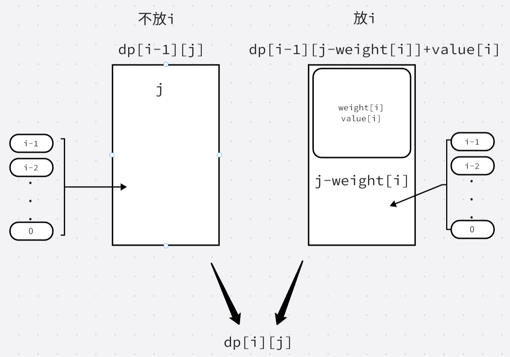

# 一. 动态规划入门

## 509. 斐波那契数

[509. 斐波那契数](https://leetcode.cn/problems/fibonacci-number/)

**斐波那契数** （通常用 `F(n)` 表示）形成的序列称为 **斐波那契数列** 。该数列由 `0` 和 `1` 开始，后面的每一项数字都是前面两项数字的和。也就是：

```
F(0) = 0，F(1) = 1
F(n) = F(n - 1) + F(n - 2)，其中 n > 1
```

给定 `n` ，请计算 `F(n)` 。

```java
class Solution {
    public int fib(int n) {
        if (n == 0)
            return 0;
        if (n == 1)
            return 1;
        int[] dp = new int[n + 1];
        dp[0] = 0;
        dp[1] = 1;
        for (int i = 2; i <= n; i++) {
            dp[i] = dp[i - 1] + dp[i - 2];
        }
        return dp[n];
    }
}
```

## 70. 爬楼梯

[70. 爬楼梯](https://leetcode.cn/problems/climbing-stairs/)

假设你正在爬楼梯。需要 `n` 阶你才能到达楼顶。

每次你可以爬 `1` 或 `2` 个台阶。你有多少种不同的方法可以爬到楼顶呢？

```java
class Solution {
    public int climbStairs(int n) {
        if (n == 1) return 1;
        int[] dp = new int[n + 1];
        dp[0] = 1;
        dp[1] = 1;
        for (int i = 2; i <= n; i++) {
            dp[i] = dp[i - 1] + dp[i - 2];
        }
        return dp[n];
    }
}
```

## 746. 使用最小花费爬楼梯

[746. 使用最小花费爬楼梯](https://leetcode.cn/problems/min-cost-climbing-stairs/)

给你一个整数数组 `cost` ，其中 `cost[i]` 是从楼梯第 `i` 个台阶向上爬需要支付的费用。一旦你支付此费用，即可选择向上爬一个或者两个台阶。

你可以选择从下标为 `0` 或下标为 `1` 的台阶开始爬楼梯。

请你计算并返回达到楼梯顶部的最低花费。

> `dp[i]` 代表到第`i`个楼梯最小花费
>
> 初始化`dp[2]`为`cost[0],cost[1]`的较小值

```java
class Solution {
    public int minCostClimbingStairs(int[] cost) {
        int[] dp = new int[cost.length + 1];
        dp[2] = Math.min(cost[0], cost[1]);
        for (int i = 3; i <= dp.length - 1; i++) {
            dp[i] = Math.min(dp[i - 1] + cost[i - 1], dp[i - 2] + cost[i - 2]);
        }
        return dp[dp.length - 1];
    }
}
```


## P1216 数字三角形 Number Triangles

[P1216 [USACO1.5\] [IOI1994]数字三角形 Number Triangles - 洛谷 | 计算机科学教育新生态 (luogu.com.cn)](https://www.luogu.com.cn/problem/P1216)

观察下面的数字金字塔。


写一个程序来查找从最高点到底部任意处结束的路径，使路径经过数字的和最大。每一步可以走到左下方的点也可以到达右下方的点。


在上面的样例中，从 $7 \to 3 \to 8 \to 7 \to 5$ 的路径产生了最大权值。

> tags: dp

Ideas：

> 从下往上走，$dp[j] = Max(dp[j], dp[j+1]+a[i][j])$

```java
import java.io.*;
import java.util.*;
public class Main {
    static Scanner s = new Scanner(System.in);
    static Read r = new Read();
    static int inf = (int) 1e9;
    static int N, dp[], a[][];
    public static void main(String[] args) throws IOException {
    	N = r.nextInt();
    	dp = new int[N + 2];
    	a = new int[N + 1][N + 1];
    	for(int i = 1; i<=N; i ++)
    		for(int j = 1; j<=i; j ++)
    			a[N - i + 1][j] = r.nextInt();
    	for(int i = 1; i<=N; i++)
    		for(int j = 1; j<= N - i + 1; j++) 
    			dp[j] = Math.max(dp[j], dp[j + 1]) + a[i][j];
    	System.out.print(dp[1]);
    }
}
class Read{
	StreamTokenizer st = new StreamTokenizer(new BufferedReader(new InputStreamReader(System.in)));
	public int nextInt() throws IOException {
		st.nextToken();
		return (int)st.nval;
	}
}
```

# 二. 01背包



链接：https://ac.nowcoder.com/acm/problem/226516

你有一个背包，最多能容纳的体积是V。 

现在有n种物品，每种物品有任意多个，第i种物品的体积为$v_i$ ,价值为$w_i$。 

（1）求这个背包至多能装多大价值的物品？ 

（2）若背包恰好装满，求至多能装多大价值的物品？

>    第二问：
>
>    ​	初始化：$dp[0][1 \sim n] =-inf$  物品为0时，所有容量大于0的背包装不满。即该状态不合法。
>
>    ​	$dp[i][j] = max(dp[i-1][j],dp[i-1][j-v[i]]+w[i])$
>
>    ​	一维：
>
>    ​	$dp[1 \sim n] = -inf$
>
>    ​	$dp[j] = max(dp[j],dp[j-v[i]]+w[i])$

```java
import java.util.*;
public class Main {
    static Scanner s = new Scanner(System.in);
    static int N, V, v[], w[], inf = (int)1e9;
    static long dp1[], dp2[];
    public static void main(String[] args) {
    	N = s.nextInt();
    	V = s.nextInt();
    	dp1 = new long[V + 1];
    	dp2 = new long[V + 1];
    	v = new int[N + 1];
    	w = new int[N + 1];
    	for(int i = 1; i<=N; i++) {
    		v[i] = s.nextInt();
    		w[i] = s.nextInt();
    	}
    	for(int i = 1; i<=V; i++) dp2[i] = -inf;//初始化不合法状态
    	for(int i = 1; i<=N; i++) {
    		for(int j = V; j>=v[i]; j--) {
    			dp1[j] = Math.max(dp1[j], dp1[j - v[i]]+w[i]);
    			dp2[j] = Math.max(dp2[j], dp2[j - v[i]]+w[i]);
    		}
    	}
    	System.out.print(dp1[V] + "\n" + (dp2[V]<0? 0:dp2[V]));
    }
}
```


## P1048 【模版】采药

[P1048 [NOIP2005 普及组\] 采药 - 洛谷 | 计算机科学教育新生态 (luogu.com.cn)](https://www.luogu.com.cn/problem/P1048)

山洞里有一些不同的草药，采每一株都需要一些时间，每一株也有它自身的价值。你一段时间，在这段时间里，你可以采到一些草药。如果你是一个聪明的孩子，你应该可以让采到的草药的总价值最大。

> tags：01背包

**Ideas：**

> ## 01背包模板题；
>
> ### 二维dp数组：
>
> 1. 确定`dp[i][j]`含义：在`j`时间里从`0~i`个草药采集的最大价值
> 2. 确定递推公式：对于第`i`个草药，我们可以选择采或者不采，对应`dp[i-1][j-time[i]]+value[i]`或者`dp[i-1][j]`，选择其中较大值则为`dp[i][j]`
> 3. 初始化`dp`数组：当`j==0`从`0~i`只能采集到价值为`0`的草药，当`i==0`（即只有第`0`个草药）当`j>=time(0)`可以采到该草药（即`dp[0][j]==value[0]`），反之则采不到（即`dp[0][j]==0`）
> 4. 确定遍历顺序：从`i==1`草药开始，对于所有时间`[1,T]`，判断第`i`个草药采或者不采，知道最后一个草药
> 5. 举例推导dp数组
>
> ## 一维dp数组：
>
> 用一维`dp[j]`数组记录`j`时间内`0~i`个草药里能采到的最大价值，每增加一个草药则更新一次dp数组；
>
> 遍历顺序：倒序遍历dp数组，如果`j>=time[i]`表示能采集当前草药，需要取采与不采的较大值，即`dp[j] =Math.max(dp[j],dp[j-time[i]]) `；反之则不可能采当前的草药，那么`dp[j] = dp[j]`
>
> 对于每一次更新整个数组：更新前`dp[j]`代表`j`时间在`0~i-1`内能采到的最大价值，更新后表示在`j`时间在`0~i`内能采到的最大价值

> 二维dp数组：

```java
import java.util.Scanner;
public class Main {
	static int T, M;
	static int[] time,value;
    public static void main(String[] args) {
        Scanner s = new Scanner(System.in);
        T = s.nextInt();
        M = s.nextInt();
        time = new int[M];
        value = new int[M];
        for (int i = 0; i <M; i++) {
			time[i]= s.nextInt();
			value[i] =s.nextInt();
		}
        int[][] dp = new int[M][T+1];
        //初始化dp
        for(int i =0;i<=M-1;i++) {
        	dp[i][0] = 0;
        }
        for(int i = 0;i<=T;i++) {
        	if (i>=time[0]) {
				dp[0][i] = value[0];
			}
        }
        //遍历
        for(int i = 1;i<=M-1;i++) {
        	for(int j = 1;j<=T;j++) {
        		if (j<time[i]) {
					dp[i][j] = dp[i-1][j]; 
				}else {
					dp[i][j]= Math.max(dp[i-1][j], dp[i-1][j-time[i]]+value[i]); 
				}
        	}
        }
        System.out.println(dp[M-1][T]);                
    }
}
```

> 一维dp数组

```java
import java.util.Scanner;
public class Main {
    public static void main(String[] args) {
        Scanner s = new Scanner(System.in);
        int T = s.nextInt();
        int M = s.nextInt();
        int[] value = new int[M];
        int[] time = new int[M];
        for (int i = 0; i <= M - 1; i++) {
            time[i] = s.nextInt();
            value[i] = s.nextInt();
        }
        int[] dp = new int[T + 1];
        for (int i = 0; i <= M - 1; i++) {
            for (int j = T; j >= time[i]; j--) {
                dp[j] = Math.max(dp[j], dp[j - time[i]] + value[i]);
            }
        }
        System.out.println(dp[T]);
    }
}
```


# 


# 三. 完全背包

链接：https://ac.nowcoder.com/acm/problem/226516

你有一个背包，最多能容纳的体积是V。 

现在有n种物品，每种物品有任意多个，第i种物品的体积为$v_i$ ,价值为$w_i$。 

（1）求这个背包至多能装多大价值的物品？ 

>    对于当前第$i$个物品不选或者选多个
>
>    不选：在$0\sim i-1$个物品中$j$容量能装的最大价值
>
>    选：在$0 \sim i$个物品中$j - v[i]$容量能装的最大价值 + $w[i]$
>
>    二维dp数组：
>
>    ​	$dp[i][j] = max(dp[i -1][j],dp[i][j-v[i]]+w[i])$
>
>    一维dp数组：
>
>    ​	$dp[j] = max(dp[j] ,dp[j-v[i]]+w[i])$
>
>    $O(n^2)$

（2）若背包恰好装满，求至多能装多大价值的物品？

---

>    初始化$dp[1\sim n] = -inf$

```java
import java.util.*;
public class Main {
    static Scanner s = new Scanner(System.in);
    static int N, V, v[], w[], inf = (int)1e9;
    static long dp1[], dp2[];
    public static void main(String[] args) {
    	N = s.nextInt();
    	V = s.nextInt();
    	dp1 = new long[V + 1];
    	dp2 = new long[V + 1];
    	v = new int[N + 1];
    	w = new int[N + 1];
    	for(int i = 1; i<=N; i++) {
    		v[i] = s.nextInt();
    		w[i] = s.nextInt();
    	}
    	for(int i = 1; i<=V; i++) dp2[i] = -inf;
    	
    	for(int i = 1; i<=N; i++) {
    		for(int j = v[i]; j<=V; j++) {
    			dp1[j] = Math.max(dp1[j], dp1[j - v[i]]+w[i]);
    			dp2[j] = Math.max(dp2[j], dp2[j - v[i]]+w[i]);
    		}
    	}
    	System.out.print(dp1[V] + "\n" + (dp2[V]<0? 0:dp2[V]));
    }
}
```


## P1616【模版】疯狂的采药

[P1616 疯狂的采药 - 洛谷 | 计算机科学教育新生态 (luogu.com.cn)](https://www.luogu.com.cn/problem/P1616)

山洞里有一些不同种类的草药，采每一种都需要一些时间，每一种也有它自身的价值。我会给你一段时间，在这段时间里，你可以采到一些草药。如果你是一个聪明的孩子，你应该可以让采到的草药的总价值最大。”

$1$. 每种草药可以无限制地疯狂采摘。

$2$. 药的种类眼花缭乱，采药时间好长好长啊！师傅等得菊花都谢了！

```java
import java.util.Scanner;
public class Main {
	static int T,M;
	static int[] time, value;
	static long[] dp;
	public static void main(String[] args) {
        Scanner s = new Scanner(System.in);
        T = s.nextInt();
        M = s.nextInt();
        time = new int[M];
        value = new int[M];
        dp = new long[T+1];
        for(int i = 0;i<=M-1;i++) {
        	time[i] = s.nextInt(); 
        	value[i] = s.nextInt(); 
        }
        for(int i = 0;i<=M-1;i++) {
        	for(int j = time[i];j<=T;j++) {
        		dp[j] = Math.max(dp[j], dp[j-time[i]]+value[i]);
        	}
        }
        System.out.println(dp[T]);
    }
 }
```


# 四.  不同路径

## 63. 不同路径 II

[63. 不同路径 II](https://leetcode.cn/problems/unique-paths-ii/)

一个机器人位于一个 `m x n` 网格的左上角 （起始点在下图中标记为 “Start” ）。

机器人每次只能向下或者向右移动一步。机器人试图达到网格的右下角（在下图中标记为 “Finish”）。

现在考虑网格中有障碍物。那么从左上角到右下角将会有多少条不同的路径？

网格中的障碍物和空位置分别用 `1` 和 `0` 来表示。

```java
class Solution {
    public int uniquePathsWithObstacles(int[][] obstacleGrid) {
      
        int m = obstacleGrid.length;
        int n = obstacleGrid[0].length;
         if(obstacleGrid[0][0]==1||obstacleGrid[m-1][n-1]==1)return 0;
        int[][] dp = new int[m][n];
        dp[0][0] = 1;
        for(int i=1;i<=m-1;i++){
            if(obstacleGrid[i][0]==1){
                dp[i][0] = 0;
            }else{
                dp[i][0] = dp[i-1][0];
            }
        }
        for(int i=1;i<=n-1;i++){
            if(obstacleGrid[0][i]==1){
                dp[0][i] = 0;
            }else{
                dp[0][i] = dp[0][i-1];
            }
        }
        for(int i=1;i<=m-1;i++){
            for(int j=1;j<=n-1;j++){
                if(obstacleGrid[i][j]==1){
                    dp[i][j] =0;
                }else{
                    dp[i][j] = dp[i-1][j]+dp[i][j-1];
                }
            }
        }
        return dp[m - 1][n - 1];

    }
}
```

## P1002 过河卒

[P1002 [NOIP2002 普及组\] 过河卒 - 洛谷 | 计算机科学教育新生态 (luogu.com.cn)](https://www.luogu.com.cn/problem/P1002)

棋盘上 $A$ 点有一个过河卒，需要走到目标 $B$ 点。卒行走的规则：可以向下、或者向右。同时在棋盘上 $C$ 点有一个对方的马，该马所在的点和所有跳跃一步可达的点称为对方马的控制点。因此称之为“马拦过河卒”。

棋盘用坐标表示，$A$ 点 $(0, 0)$、$B$ 点 $(n, m)$，同样马的位置坐标是需要给出的。

> 二维dp数组

Ideas：

> 1. `dp[i][j]`含义：到达`i`行`j`列有`dp[i][j]`条路线
> 2. 状态转移方程：对于除了第一行和第一列的每一个位置，它可以从上方或者左方到达，到达该位置的路线数等于到上方路线数加上到左方路线数，故`dp[i][j] = dp[i-1][j]+dp[i][j-1]`
> 3. 初始化dp数组：第一行只能到达第一个障碍的左侧的位置，且路线数为1。第一列只能到达第一个障碍上方的位置且路线为1。其余地方则为0
> 4. 遍历顺序：遍历除第一行和第一列位置即可，**需要注意的是有障碍的位置的地方到达其位置的路线数应该为0，即`dp[i][j]=0`**

```java
import java.util.Scanner;
public class Main {
	static int bi,bj,hi,hj;
	static int[][] map;
	static int[] di = {-2,-2,-1,1,2,2,1,-1};//左上角顺时针
	static int[] dj = {-1,1,2,2,1,-1,-2,-2};
    public static void main(String[] args) {
        Scanner s = new Scanner(System.in);
        	bi = s.nextInt();
        	bj = s.nextInt();
        	hi = s.nextInt();
        	hj = s.nextInt();
        	map = new int[bi+1][bj+1];
        	putH();//放🐎
        	long [][] dp = new long [bi+1][bj+1];
        	for(int i = 0;i<=bi;i++) {//初始化dp数组
        		if(map[i][0]==1)break;
        		dp[i][0] = 1;
        	}
        	for (int j = 0; j <=bj; j++) {
        		if(map[0][j]==1)break;
        		dp[0][j]= 1; 
			}
        	for (int i = 1; i <=bi; i++) {
				for (int j = 1; j <=bj; j++) {
					if (map[i][j] ==1 ) continue;//当前是🐎的地盘跳过
					dp[i][j]= dp[i-1][j]+dp[i][j-1]; 
				}
			}
        	System.out.println(dp[bi][bj]);
        }
	private static void putH() {
		map[hi][hj] = 1;
		for (int i = 0; i <=7; i++) {
			int x = hi+di[i];
			int y = hj+dj[i];
			if (x>=0&&y>=0&&x<=bi&&y<=bj) {
				map[hi+di[i]][hj+dj[i]] = 1;
			}
		}
	}
    }

```

# 五. 线性`dp`

## 子序列问题

### 最长递增子序列$LIS$

https://ac.nowcoder.com/acm/problem/226831

给你一个长度为n的数组，求最长的严格上升子序列的长度。

>    $f[i] = max(f[j]) + 1,(1\leq j \leq i-1, a_j \le a_i)$

>    优化
>
>    将最长子递增子序列按长度分类，用`p[]`记录长度为$i$的序列末尾元素的最小值（可以证明该数组**严格**递增），对于将要加入的新元素$a_i$，找到末尾元素**小于**（没有等于）$a_i$的最长的子序列（二分查找），该元素可以作为比当前序列长1的序列的最小末尾元素（加入后序列仍然严格递增，因为它只会让后一个序列的最小末尾元素更小），若没有比当前序列长1的序列则会增加一个新长度（更长）的序列，记录长度的最大值。
>
>    新问题：
>
>    至少有多少个严格递增序列？
>
>    最长不严格递增序列？
>
>    至少有多少个不严格递增序列？

```java
import java.util.*;
public class Main {
    static Scanner s = new Scanner(System.in);
    static int n, a[], p[];
    public static void main(String[] args) {
    	n = s.nextInt();
    	a = new int[n + 1];
    	p = new int[n + 2];
    	int len = 0;
    	p[0] = -(int)2e9; //确保第一个数能找到位置（有负数元素）
    	for(int i = 1; i <= n; i++) {
    		a[i] = s.nextInt();
    		int l = 0, r = len, idx = 0;
    		while(l <= r) {
    			int m = (l + r) >>> 1;
    			if(p[m] < a[i]) {
    				idx = m;
    				l = m + 1;
    			}else {
    				r = m - 1;
    			}
    		}
    		p[idx + 1] = a[i];
    		len = Math.max(len, idx + 1);
    	}
    	System.out.print(len);
    }
}
```


### 最大子序列和

P1115最大子段和(模板题)

[P1115 最大子段和 - 洛谷 | 计算机科学教育新生态 (luogu.com.cn)](https://www.luogu.com.cn/problem/P1115)

给出一个长度为 $n$ 的序列 $a$，选出其中连续且非空的一段使得这段和最大。

```java
import java.util.Scanner;
public class Main {
	public static void main(String[] args) {
        Scanner s = new Scanner(System.in);
        int N = s.nextInt();
        int[] arr = new int[N];
        for (int i = 0; i <=N-1; i++) {
			arr[i] = s.nextInt();
		}
        long[] dp = new long[N];
        dp[0] = arr[0];
        long res = dp[0];
        for (int i = 1; i <=N-1; i++) {
					dp[i] = Math.max(dp[i-1]+arr[i],arr[i]);//对于当前元素加入或者重新计数
					res = Math.max(res, dp[i]);
        }
        System.out.println(res);      
    }
 }
```

### 最长公共子序列

>    若$A_i=B_i$，$dp[i][j] = dp[i-1][j-1]+1$。
>
>    否则，$dp[i][j] = max(dp[i-1][j],dp[i][j-1])$

## P2758编辑距离

https://www.luogu.com.cn/problem/P2758

设 $A$ 和 $B$ 是两个字符串。我们要用最少的字符操作次数，将字符串 $A$ 转换为字符串 $B$。这里所说的字符操作共有三种：

1. 删除一个字符；
2. 插入一个字符；
3. 将一个字符改为另一个字符。

$A, B$ 均只包含小写字母。

>    若$A_i ==B_i$，$dp[i][j] = dp[i-1][j-1]$
>
>    否则，$dp[i][j] = min(dp[i-1][j], dp[i][j-1],dp[i-1][j-1])$（分别对应 删 增 改） 
>
>    **注意：**
>
>    1.    $dp$数组初始化
>    2.    若$A_i \neq B_i$，操作数记得$+1$

```java
import java.util.*;
public class Main {
	static String A, B;
	static int l1, l2, dp[][];
	public static void main(String[] args) {
		Scanner s = new Scanner(System.in);
		A = s.next();
		B = s.next();
		l1 = A.length();
		l2 = B.length();
		dp = new int[l1+1][l2+1];
		for(int i = 1; i<=l2; i++) dp[0][i] = i;
		for(int j = 1; j<=l1; j++) dp[j][0] = j;
		for(int i = 1; i<=l1; i++) {
			for(int j = 1;j<=l2; j++) {
				if(A.charAt(i-1) == B.charAt(j-1)) dp[i][j] = dp[i-1][j-1];
				else dp[i][j] = Math.min(Math.min(dp[i-1][j]+1, dp[i][j-1]+1), dp[i-1][j-1]+1);
			}
		}
		System.out.print(dp[l1][l2]);
	}
}
```

# 六. 区间dp

## P1775 石子合并（弱化版）

https://www.luogu.com.cn/problem/P1775

设有 $N(N \le 300)$ 堆石子排成一排，其编号为 $1,2,3,\cdots,N$。每堆石子有一定的质量 $m_i\ (m_i \le 1000)$。现在要将这 $N$ 堆石子合并成为一堆。每次只能合并相邻的两堆，合并的代价为这两堆石子的质量之和，合并后与这两堆石子相邻的石子将和新堆相邻。合并时由于选择的顺序不同，合并的总代价也不相同。试找出一种合理的方法，使总的代价最小，并输出最小代价。

---

1.    $dp[i][j]$：将$[i,j]$的石子合并的最小花费
2.    $dp[i][j] = min(dp[i][k] +dp[k+1][j])+\sum_i^ja_l,(i+1 \le k \le j-1)$
3.    初始化：$dp[i][j] = INF$

4.    遍历顺序：
      -    枚举长度：$l\in[2, n]$
      -    枚举左端点：$i\in[1,n-l+1]$，则右端点为：$j = i+l - 1$
      -    枚举分割点：$k \in [i,j-1]$，则将$[i,j]$分割为$[i,k] \ \ [k+1,j]$
5.    时间复杂度：$O(n^3)$

```java
import java.util.*;
public class Main {
    static Scanner s = new Scanner(System.in);
    static int n, b[], dp[][];
    public static void main(String[] args) {
    	n = s.nextInt();
    	b = new int[n + 1];
    	for(int i = 1; i<=n; i++) {
    		b[i] = s.nextInt();
    		b[i] += b[i - 1];
    	}
    	dp = new int[n + 1][n + 1];
    	for(int l = 2; l <= n; l++) {
    		for(int i = 1; i <= n - l + 1; i++) {
    			int j = i + l - 1;
    			dp[i][j] = (int) 1e9;
    			for(int k = i; k <= j - 1; k++) {
    				dp[i][j] = Math.min(dp[i][j], dp[i][k] + dp[k + 1][j] + b[j] - b[i - 1]);
    			}
    		}
    	}
    	System.out.print(dp[1][n]);
    }
}
```

# 七. 计数类dp

# 八. 记忆化搜索

## P1434滑雪

https://www.luogu.com.cn/problem/P1434

Michael 喜欢滑雪。这并不奇怪，因为滑雪的确很刺激。可是为了获得速度，滑的区域必须向下倾斜，而且当你滑到坡底，你不得不再次走上坡或者等待升降机来载你。Michael 想知道在一个区域中最长的滑坡。区域由一个二维数组给出。数组的每个数字代表点的高度。下面是一个例子：

```plain
1   2   3   4   5
16  17  18  19  6
15  24  25  20  7
14  23  22  21  8
13  12  11  10  9
```
一个人可以从某个点滑向上下左右相邻四个点之一，当且仅当高度会减小。在上面的例子中，一条可行的滑坡为 $24-17-16-1$（从 $24$ 开始，在 $1$ 结束）。当然    $25$－$24$－$23$－$\ldots$－$3$－$2$－$1$ 更长。事实上，这是最长的一条。

> 新的搜索要用到之前搜索过的结果，将搜索过的结果保存下来，避免重复搜索，即记忆化搜索

```java
import java.io.*;
import java.util.*;
public class Main {
    static Scanner sc = new Scanner(System.in);
    static PrintWriter pw = new PrintWriter(new BufferedWriter(new OutputStreamWriter(System.out)));
    static long inf = (long)2e9, INF = (long)2e18;
    static int r, c, a[][], f[][];    
    public static void main(String[] args) throws IOException {
        r = sc.nextInt();
        c = sc.nextInt();
        a = new int[r][c];
        f = new int[r][c];
        for(int i = 0; i < r; i++)
            for(int j = 0; j < c; j ++)
                a[i][j] = sc.nextInt();
        int ans = 0;
        for(int i = 0; i < r; i ++)
            for(int j = 0; j < c; j ++)
                ans = Math.max(dp(i, j), ans);
        pw.println(ans);
        pw.flush();
        pw.close();
    }
    static int[] dx = {1, -1, 0, 0}, dy = {0, 0, 1, -1};
    public static int dp(int x, int y){
        if(f[x][y] > 0) return f[x][y];
        f[x][y] = 1;
        for(int i = 0; i < 4; i ++){
            int nx = x + dx[i];
            int ny = y + dy[i];
            if(nx >= 0 && nx < r && ny >= 0 && ny < c && a[nx][ny] < a[x][y]){
                f[x][y] = Math.max(f[x][y], dp(nx ,ny) + 1);
            }   
        }
        return f[x][y];
    }
}
 
```

