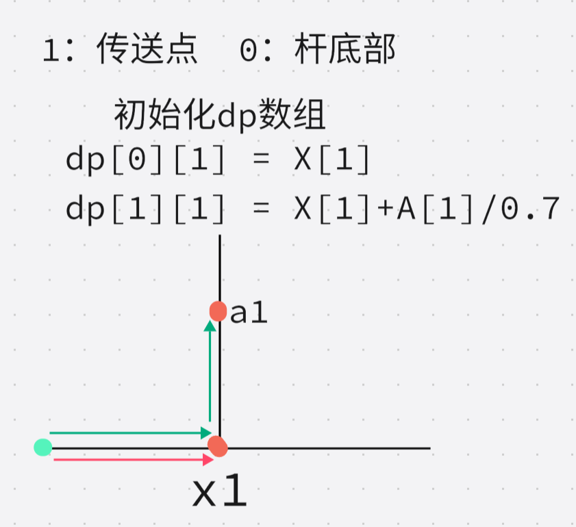
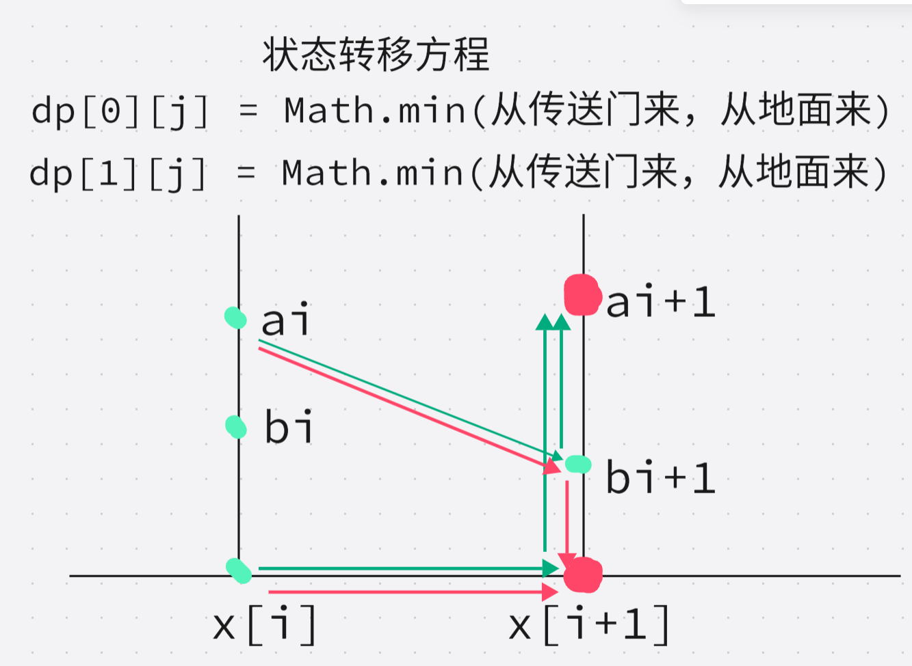

# A

> 阶乘，（有点点陷阱，39！之后的阶乘数后9位不变）

```java
public class Main {
    public static void main(String[] args) {
    		long L = Long.parseLong("202320232023");
        	long sum=0;
        	long mal=1;
        	for(long i=1;i<=L;i++) {
        		mal*=i;
        		mal%=(long)1e9;
        		sum+=mal;
        		sum%=(long)1e9;
        	}        	
        	System.out.println(sum%(long)1e9);        	      
    }
}
```


# B

> 进制转换

```java
public class Main {
	public static void main(String[] args) {
		int j  = 0;//第j个幸运数
		for (int i = 1; i <=1145144; i++) {
			if(isF(i)) {
				j++;
				System.out.println("第"+j+"个:"+i);
				if (j==2023) {
					break;
				}
			}
		}
	}
	private static boolean isF(int i) {
		int x = i;
		//二进制
		int sum = 0;
		while(x>0) {
			sum+=(x%2);
			x/=2;
		}
		if (i%sum!=0) return false;	
		//八进制
		x=i;sum=0;
		while(x>0) {
			sum+=(x%8);
			x/=8;
		}
		if (i%sum!=0) return false;
		
		//十进制
		x=i;sum=0;
		while(x>0) {
			sum+=(x%10);
			x/=10;
		}
		if (i%sum!=0) return false;		
		//十进制
		x=i;sum=0;
		while(x>0) {
			sum+=(x%16);
			x/=16;
		}
		if (i%sum!=0) return false;			
		return true;
	}
}
```


# E

这天，一只蜗牛来到了二维坐标系的原点。

在 x 轴上长有 n 根竹竿。它们平行于 y 轴，底部纵坐标为 0，横坐标分别为 x1, x2, ..., xn。竹竿的高度均为无限高，宽度可忽略。蜗牛想要从原点走到第 n 个竹竿的底部也就是坐标 (xn, 0)。它只能在 x 轴上或者竹竿上爬行，在 x 轴上爬行速度为 1 单位每秒；由于受到引力影响，蜗牛在竹竿上向上和向下爬行的速度分别为 0.7 单位每秒和 1.3 单位每秒。

为了快速到达目的地，它施展了魔法，在第 i 和 i + 1 根竹竿之间建立了传送门（0 < i < n），如果蜗牛位于第 i 根竹竿的高度为 ai 的位置 (xi , ai)，就可以瞬间到达第 i + 1 根竹竿的高度为 bi+1 的位置 (xi+1, bi+1)，请计算蜗牛最少需要多少秒才能到达目的地。

> tags: 动态规划

Ideas:

> 1. 确定`dp[i][j]`的含义：`dp[i][j]`代表到当前位置最短用时，`i`代表状态在传送门或地面，`j`代表杆子位置
> 2. 状态转移方程：
> 3. 遍历顺序：对于每一根杆子其上的传送点和地面最快到时间都分别与前一根杆子的传送点地面的最快到达时间有关，所以需要求出第`j`根杆子的两个状态值，才能求出下一个




```java
import java.util.Scanner;
public class Main {	
    public static void main(String[] args) {
        Scanner s = new Scanner(System.in);
        int N = s.nextInt();
        int[] X = new int[N+1];
        int[] A = new int[N+1];
        int[] B = new int[N+1];
        for (int i = 1; i <=N; i++) {
			X[i] = s.nextInt(); 
		}
        for (int i = 1; i <=N-1; i++) {
			A[i] = s.nextInt();
			B[i+1] = s.nextInt();
		}
        double [][] dp = new double [2][N+1];
        dp[0][1] = X[1];
        dp[1][1] = X[1]+A[1]/0.7;
        
        for (int j = 2; j <=N; j++) {
        	dp[0][j] = Math.min(dp[0][j-1]+X[j]-X[j-1],dp[1][j-1]+B[j]/1.3); 
        	dp[1][j]= Math.min(dp[0][j-1]+X[j]-X[j-1]+A[j]/0.7,dp[1][j-1]+Math.abs(A[j]-B[j])/(A[j]>B[j]?0.7:1.3)); 
		}

        System.out.printf("%.2f",dp[0][N]);
        }
    }

```

